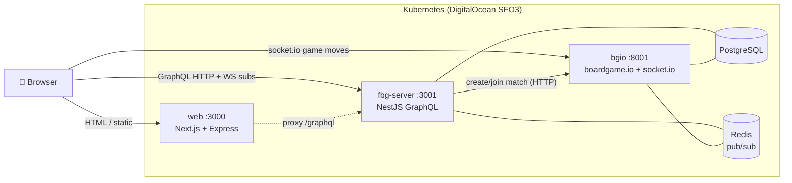

# FreeBoardGames.org — Backend & Scaling Onboarding

> **Audience:** engineers joining the **backend (BE)** of FreeBoardGames.org (FBG).
> **Goal:** understand how the system is built, how it scales for traffic, the DevOps that runs it, and — specifically — **how realtime messaging stays correct** (how we "don't confuse different sockets") across clustered processes.
>
> **Status of this doc:** written 2026-06 against commit `41a0077b` (the current `master` / `upstream/master`). Every claim is backed by a `path:line` reference so you can jump straight to the code. Where the repo's *configured defaults* differ from what the architecture is *designed for*, you'll see an explicit **`⚠️ Reality check`** callout — onboarding should tell you the truth, not the brochure.

---

## TL;DR — the one-paragraph mental model

FBG is **not** one backend. It is **three Node processes** plus **two datastores**, deployed to **Kubernetes**:

1. **`web`** — a **Next.js + Express** server (SSR pages, static assets, a same-origin GraphQL proxy). Port `3000`.
2. **`fbg-server`** — a **NestJS + Apollo GraphQL** API (lobby, rooms, matchmaking, chat, users, auth). Port `3001`. This is the "BE" most people mean. **It has no socket.io and no job queues.**
3. **`bgio`** — the **boardgame.io** realtime game server, which **is** the socket.io part. Port `8001`. It is booted from the **same Docker image as `web`**, switched by `SERVER_TYPE=BGIO`.

Datastores: **PostgreSQL** (lobby + game state) and **Redis** (pub/sub only — *not* a queue).

If you remember nothing else: **the GraphQL API and the realtime game server are different processes with different transports and different "don't-cross-the-streams" mechanisms.** Chapters 3 and 4 are about exactly those two mechanisms.

---

## ⚠️ Read this first: four assumptions this codebase will overturn

New engineers (and the brief that commissioned these docs) usually arrive with the mental model *"FBG scales socket.io across a cluster using queues."* That is **directionally right but wrong in the specifics**. Calibrate now:

| Common assumption | Verdict | What's actually true | Where to read |
|---|---|---|---|
| "The backend uses **socket.io**" | ⚠️ **Partly** | socket.io lives in **`bgio` (boardgame.io)**, a *separate* process — **not** in `fbg-server`. `fbg-server`'s realtime is **GraphQL subscriptions over WebSocket**. | [Ch.4](04-boardgameio-sockets.md), [Ch.3](03-realtime-pubsub.md) |
| "We use **queues**" | ❌ **No queues** | There is **no Bull/BullMQ/Agenda/cron**. The async fabric is **Redis Pub/Sub** (fire-and-forget fan-out) — used in **two** independent places. | [Ch.3](03-realtime-pubsub.md) |
| "We **cluster socket.io** (with a Redis adapter)" | ⚠️ **Yes, but no socket.io adapter** | There is **no `socket.io-redis`/`@socket.io/redis-adapter`**. Clustering = **per-match pod pinning** + **nginx cookie affinity** + **shared Postgres state** + **`@boardgame.io/redis-pubsub`** (a boardgame.io-layer relay). | [Ch.4](04-boardgameio-sockets.md), [Ch.5](05-scaling-clustering.md) |
| "We **scaled for large traffic**" | ⚠️ **Architected, not configured** | The design supports horizontal scale, but the **public chart ships `replicas: 1`** for every tier, **no autoscaler, no PodDisruptionBudget, no resource limits, single Redis + single Postgres**. Real prod numbers live in a **private `values.prod.yaml`**. | [Ch.5](05-scaling-clustering.md) |

**How we "don't get confused between different sockets" (the headline question):** there are **two** isolation mechanisms, one per realtime system —

- **`fbg-server`** namespaces every pub/sub channel by **entity id** — `room/{roomId}`, `chat/{channelType}/{channelId}`, `lobby`. A subscriber only ever listens on the exact channel for its entity, so room `abc` events can't reach room `xyz`. ([Ch.3](03-realtime-pubsub.md))
- **`bgio`** isolates by **`matchID`**: boardgame.io joins each player's socket into a socket.io **room named after the match**, and `fbg-server` **pins all players of a match to the same bgio pod**. A move in match `A` is broadcast only to room `A`. ([Ch.4](04-boardgameio-sockets.md))

---

## Reading order

Read top-to-bottom for a full picture, or jump to the chapter that matches your task.

| # | Chapter | What you'll learn | Diagrams |
|---|---|---|---|
| 1 | **[Architecture overview](01-architecture-overview.md)** | The three processes, one-image-two-modes, request routing, where data lives. | 🗺️ runtime/hosting map · 🔀 request routing (drawio) |
| 2 | **[fbg-server: NestJS GraphQL](02-fbg-server.md)** | Modules (rooms, match, chat, users), GraphQL API, JWT auth, CSRF, TypeORM data model, health checks. | mermaid ER + module map |
| 3 | **[Realtime & pub/sub: "the queues"](03-realtime-pubsub.md)** | GraphQL subscriptions over Redis pub/sub, the dev-vs-prod PubSub swap, and **topic-namespacing isolation**. | mermaid sequence + isolation |
| 4 | **[boardgame.io & socket.io](04-boardgameio-sockets.md)** | bgio boot, socket.io transport, **matchID rooms**, **match→pod pinning**, the redis-pubsub relay, game-state persistence. | 🎯 match-pinning (drawio) + mermaid |
| 4b | **[FBG vs. vanilla boardgame.io](04b-fbg-vs-boardgameio.md)** | What FBG **uses as-is**, **replaces** (the Lobby!), and **adds** vs the upstream OSS framework — and how to read boardgame.io's docs as an FBG engineer. | mermaid layer-cake |
| 5 | **[Scaling & clustering](05-scaling-clustering.md)** | How each tier scales, sticky sessions for WebSockets, shared state, and the honest **current vs designed-for vs gaps**. | 🏗️ deployment topology (drawio) |
| 6 | **[DevOps & deployment](06-devops-deployment.md)** | Helm chart, dual-image Docker build, ingress/TLS, daily DB backups, CI (minikube e2e), GitOps deploy, Dependabot, v2 site. | mermaid CI/deploy pipeline |
| 7 | **[The web tier & Next.js](07-nextjs-web-platform.md)** | Which **Next.js features** the web app uses (and which it can't, on v9.5.5), custom-server **SSR**, the `/graphql` proxy, styling, i18n, build pipeline. | mermaid request lifecycle + build |

**Diagram sources** live in **[`diagrams/`](diagrams/)** as editable `.drawio` files (open at [app.diagrams.net](https://app.diagrams.net)). "Minor" diagrams are inline **Mermaid** and render directly on GitHub.

---

## Conventions used in these docs

- **`path/to/file.ts:42`** — a clickable jump target in your editor. Paths are relative to the repo root (these docs live in `docs/`, code lives in `fbg-server/`, `web/`, `helm/`, …).
- **`⚠️ Reality check`** — the configured/shipped behavior differs from the idealized design. Trust these; they're where production surprises come from.
- **`🔮 Designed-for`** — capability the architecture enables but that isn't switched on by default.
- Versions cited: **boardgame.io `0.49.11`**, **socket.io (server) `4.4.1`**, NestJS `8/9`, Next.js `9.5.5`. The `/v2` tree is an **experimental** rewrite (Next 13 static export) — **not** the deployed system; ignore it unless you're specifically working on it.

---

## The 30-second "where do I change X?" cheat sheet

| I want to change… | Go to | Key files |
|---|---|---|
| Lobby/room/match/chat API or rules | `fbg-server` | `fbg-server/src/{rooms,match,chat,users}/` |
| How realtime lobby/chat updates fan out | `fbg-server` pub/sub | `fbg-server/src/internal/FbgPubSubModule.ts` |
| In-game move handling / game state | `bgio` (boardgame.io) | `web/server/bgio.ts`, the game's `Game.ts` |
| Which bgio pod a match lands on | `fbg-server` match assignment | `fbg-server/src/match/MatchUtil.ts:39-53` |
| Pages, SSR, the `/graphql` proxy, `/docs` | `web` | `web/server/web.ts` |
| Replicas, env, ingress, TLS, backups | Helm | `helm/values.yaml`, `helm/templates/*` |
| What CI runs | GitHub Actions | `.github/workflows/ci.js.yml`, `misc/test_minikube` |
| How prod actually deploys | GitOps script | `misc/fbg-autoupdate/update` |

---

_Next: **[1 · Architecture overview →](01-architecture-overview.md)**_
