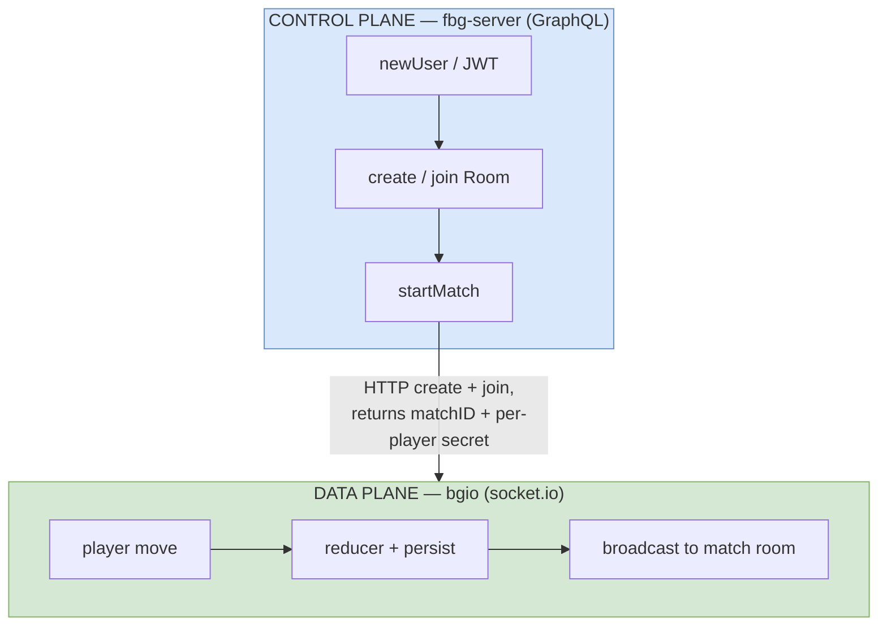
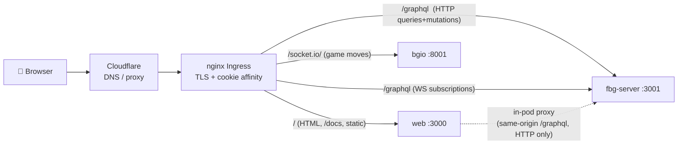

# 1 · Architecture Overview

_[← Index](00-README.md) · Next: [2 · fbg-server →](02-fbg-server.md)_

This chapter is the map. It names the moving parts, shows how a request reaches each one, and draws the line between the **control plane** (lobby/matchmaking) and the **data plane** (live gameplay). Later chapters zoom into each box.

> 🗺️ **Diagrams for this chapter:**
> - [`diagrams/01-runtime-hosting-map.drawio`](diagrams/01-runtime-hosting-map.drawio) — the full runtime, hosting and scaling map.
> - [`diagrams/02-request-routing.drawio`](diagrams/02-request-routing.drawio) — how the browser's four transports are routed.

---

## 1.1 Three processes, two of them from one image

FBG runs **three** distinct Node services. A crucial, non-obvious fact: **`web` and `bgio` are the *same* Docker image**, started in different modes; **`fbg-server` is a separate image**.

| Process | Tech | Port | Image | Role |
|---|---|---|---|---|
| **`web`** | Next.js 9.5 + Express | `3000` | `freeboardgames/web` | SSR HTML, static assets, `/docs`, and a same-origin **HTTP proxy** to `/graphql`. Not in the realtime path. |
| **`fbg-server`** | NestJS 8/9 + Apollo GraphQL | `3001` | `freeboardgames/fbg-server` | Lobby, rooms, matchmaking, chat, users, **JWT auth**. GraphQL **queries/mutations + subscriptions**. Orchestrates match creation. |
| **`bgio`** | boardgame.io 0.49 + socket.io 4.4 | `8001` | `freeboardgames/web` (mode `BGIO`) | The authoritative **realtime game server**. Applies moves, persists state, broadcasts to players. |

### One image, two modes

The web image's entrypoint branches on the `SERVER_TYPE` env var:

```bash
# web/docker_run.sh:2-6
if [ "$SERVER_TYPE" = "BGIO" ]; then
  yarn run start:bgio        # -> node server/dist/server_bgio.js   (boardgame.io, :8001)
elif [ "$SERVER_TYPE" = "WEB" ]; then
  NODE_ENV=production yarn run start:server   # -> node server/dist/server_web.js  (Next.js, :3000)
fi
```

- `web/Dockerfile:47` → `CMD ./docker_run.sh`
- The two npm scripts: `web/package.json:24` (`start:bgio`) and `:26` (`start:server`)
- They are the webpack-built outputs of `web/server/bgio.ts` and `web/server/web.ts`.

Why it matters: the **same codebase** ships the web app and the game server. When you read `web/`, remember half of it (`server/bgio.ts`, the boardgame.io game definitions) is really the **game backend**, not the website.

---

## 1.2 Control plane vs. data plane

The single most clarifying distinction in FBG:

- **Control plane** = everything *around* a game: making a user, creating a room, inviting players, starting a match, chat. This is **`fbg-server`** (GraphQL). When a match starts, `fbg-server` talks **server-to-server over HTTP** to `bgio` to create the match and mint each player's credentials.
- **Data plane** = the live game itself: moves, turn order, game state. This is **`bgio`** (socket.io). The browser connects **directly** to `bgio` for gameplay; `fbg-server` is not in that loop.



The handoff: `fbg-server`'s `startMatch` mutation calls bgio's HTTP API to `create` the match and `join` each player, then stores the resulting `bgioMatchId`, per-player `bgioSecret`, and the chosen bgio server URL on the match row (`fbg-server/src/match/match.service.ts:111-199`). The browser later reads those over GraphQL and opens a socket.io connection to that bgio URL. Full detail in [Ch.4](04-boardgameio-sockets.md).

---

## 1.3 How a request is routed (the four transports)

A single browser tab holds up to **four** connections, each routed differently by the **edge** (Cloudflare → nginx Ingress):



| Transport | From → To | Routing | Evidence |
|---|---|---|---|
| **HTML / static / `/docs`** | Browser → `web` | Ingress `/` catch-all | `helm/templates/ingress.yaml`, `web/server/web.ts:40-89` |
| **GraphQL query/mutation** (HTTP) | Browser → `fbg-server` | Ingress `/graphql`. (Locally/same-origin it can also go Browser → `web` → `fbg-server` via the in-pod proxy.) | `web/server/web.ts:84`, `web/src/pages/_app.tsx` httpLink |
| **GraphQL subscription** (WebSocket) | Browser → `fbg-server` | `wss://host/graphql` straight to fbg-server. **Not** through the web pod. | `web/src/.../AddressHelper.ts:6-12`, `_app.tsx` wsLink |
| **Game moves** (socket.io/WebSocket) | Browser → `bgio` | `wss://host/socket.io/` to the **per-match** bgio URL. | `web/src/infra/game/hooks/useConfigBuilder.tsx:100-106` |

> ⚠️ **Reality check — the web pod does NOT proxy WebSockets.** The `/graphql` proxy in `web/server/web.ts:84` (`http-proxy-middleware`) is **HTTP-only** — no `ws:true`, no `upgrade` handler. GraphQL **subscriptions** therefore reach `fbg-server` via the **edge** (`wss://host/graphql`), and socket.io reaches `bgio` via the edge. Any diagram that routes realtime traffic "through the web pod" is wrong. The web pod's proxy is a same-origin convenience for HTTP GraphQL; in the Helm/Ingress topology even HTTP `/graphql` is routed edge→fbg-server directly.

The existing infra doc `web/docs/03_infra/RunningWithNginx.stories.mdx` shows the equivalent nginx `location` blocks (including the `Upgrade`/`Connection` headers for `/graphql`), and `helm/templates/ingress.yaml` is the production source of truth — see [Ch.6](06-devops-deployment.md).

---

## 1.4 Where data lives

| Store | Used by | For what | Notes |
|---|---|---|---|
| **PostgreSQL** | `fbg-server` + `bgio` | Lobby (users, rooms, memberships, matches) **and** boardgame.io game state | One shared DB. `fbg-server` via TypeORM; `bgio` via `bgio-postgres` `PostgresStore`. |
| **Redis** | `fbg-server` + `bgio` | **Pub/Sub only** | Two independent uses: GraphQL subscriptions (`graphql-redis-subscriptions`) and bgio cross-instance relay (`@boardgame.io/redis-pubsub`). **No queue, no cache, no session store.** |

- In **production**, `fbg-server` uses a Redis-backed PubSub so events fan out across replicas; in **dev** it uses an in-memory PubSub (`fbg-server/src/internal/FbgPubSubModule.ts:13-27`). Detail in [Ch.3](03-realtime-pubsub.md).
- `bgio` persists every match's state to Postgres (`web/server/bgio.ts:11,15-21`), which is what allows more than one bgio pod to exist at all. Detail in [Ch.4](04-boardgameio-sockets.md).
- Chat messages are **not persisted** — they are pub/sub broadcasts only ([Ch.3](03-realtime-pubsub.md)).

---

## 1.5 The hosting picture (preview)

Production runs on **DigitalOcean Kubernetes (SFO3, context `do-sfo3-fbg-k8s2`)**, fronted by **Cloudflare**, deployed by **Helm**, with images on **Docker Hub** and daily DB backups to **Google Cloud Storage**. The whole topology — ingress, services, deployments, datastores, backups, CI and the GitOps deploy loop — is [Ch.5](05-scaling-clustering.md) and [Ch.6](06-devops-deployment.md). The big-picture map is [`diagrams/01-runtime-hosting-map.drawio`](diagrams/01-runtime-hosting-map.drawio).

---

## 1.6 What to take away

1. **Three processes**, not one backend. `fbg-server` (GraphQL) and `bgio` (socket.io) are different services with different transports.
2. **`web` and `bgio` are the same image** in two modes (`SERVER_TYPE`).
3. **Control plane (fbg-server) hands off to data plane (bgio)** via an HTTP create/join, then the browser talks to bgio directly.
4. **Realtime never flows through the web pod** — the edge routes subscriptions and socket.io straight to their backends.
5. **Postgres is shared; Redis is pub/sub only** (no queues).

_[← Index](00-README.md) · Next: [2 · fbg-server →](02-fbg-server.md)_
