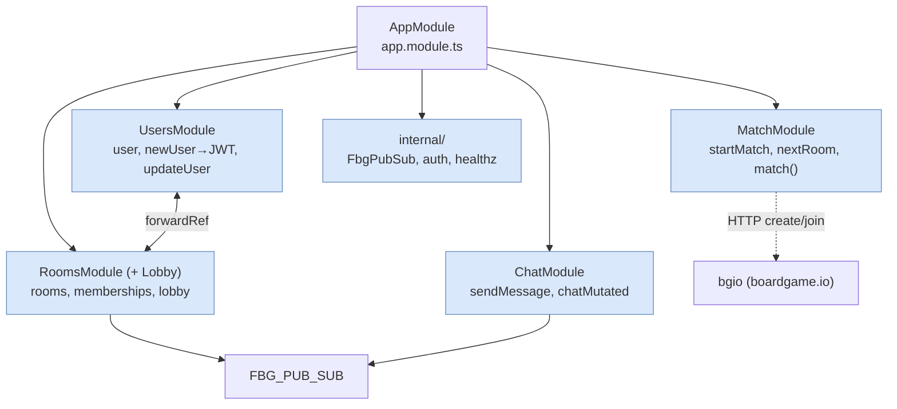
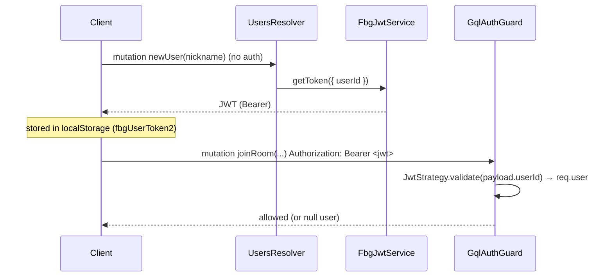
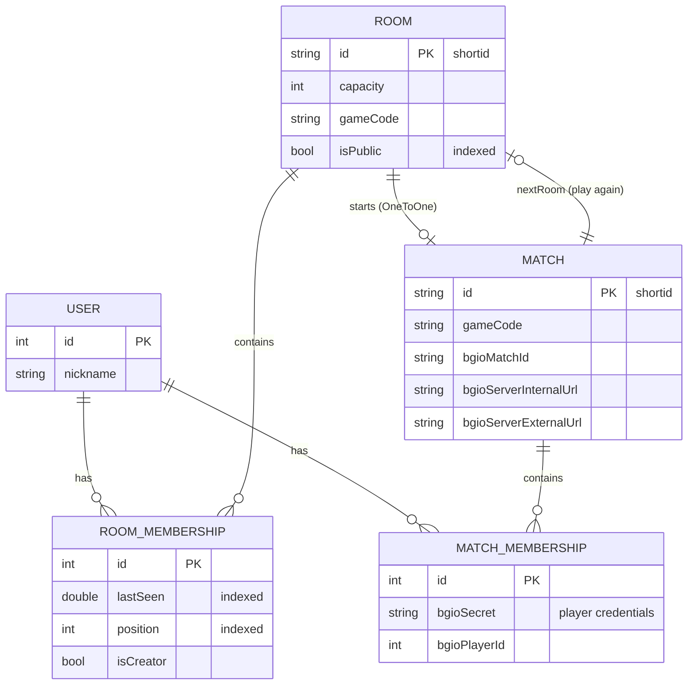
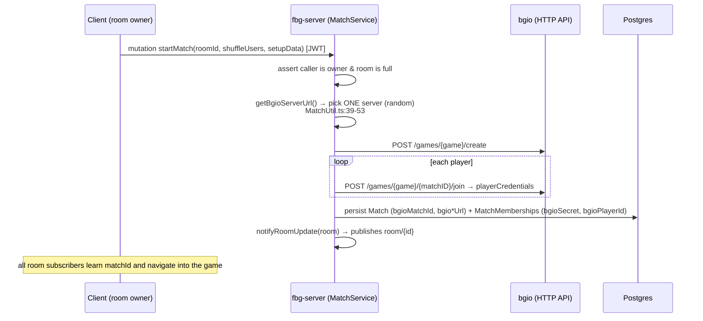

# 2 · fbg-server — the NestJS GraphQL backend

_[← 1 · Architecture](01-architecture-overview.md) · [Index](00-README.md) · Next: [3 · Realtime & pub/sub →](03-realtime-pubsub.md)_

`fbg-server` is the **control-plane backend**: users, rooms, matchmaking, chat, auth. It is a **NestJS** app exposing a **code-first Apollo GraphQL** API on **port 3001**. It talks to **PostgreSQL** (via TypeORM) and **Redis** (pub/sub — see [Ch.3](03-realtime-pubsub.md)). It has **no socket.io and no job queues**.

- **Entry point:** `fbg-server/src/main.ts` — `NestFactory`, `cookie-parser`, conditional CSRF, then `listen(PORT)` where `PORT = 3001` (`fbg-server/src/constants.ts`).
- **Root module:** `fbg-server/src/app.module.ts` — wires TypeORM, the Apollo GraphQL driver (code-first, `autoSchemaFile`), `HttpModule`, and the four feature modules.
- **Generated schema (the API contract):** `common/gql/schema.gql` (Query/Mutation/Subscription around lines 61-108).

---

## 2.1 Module map

| Module | Responsibility | Key GraphQL ops | Files |
|---|---|---|---|
| **Users** | Create/update users (nickname only); issues a JWT when a user is created. | `Query user`; `Mutation newUser` (**unguarded** — this is sign-up, returns a JWT), `Mutation updateUser` (guarded) | `fbg-server/src/users/*`, `users/db/User.entity.ts` |
| **Rooms** (+ **Lobby**) | Pre-game lobby rooms: create/join/leave, kick, reorder, shuffle, capacity. Public-room listing. Owns the `lobby` + `room/{id}` pub/sub topics. | `Query lobby`; mutations `newRoom`, `joinRoom`, `leaveRoom`, `removeFromRoom`, `moveUserUp`, `shuffleUsers`, `updateRoom`; subs `roomMutated(roomId)`, `lobbyMutated` | `fbg-server/src/rooms/*` |
| **Match** | Starts a match from a full room by calling **bgio** over HTTP to create the match + join each player (gets `playerCredentials`). "Play again" → next room. | `Query match(id)`; mutations `startMatch(roomId,…)`, `nextRoom(matchId)` | `fbg-server/src/match/*` |
| **Chat** | In-room / in-match chat. Validates membership, bad-words-filters **public** channels, truncates to 280 chars. **Not persisted.** | `Mutation sendMessage`; sub `chatMutated(channelType, channelId)` | `fbg-server/src/chat/*` |

Cross-cutting code lives in `fbg-server/src/internal/`: the pub/sub provider (`FbgPubSubModule.ts`), auth (`auth/`), and the health controller (`healthz.controller.ts`).

> **Coupling to know about:** `UsersModule` and `RoomsModule` reference each other with `forwardRef` (a circular dependency). `updateUser` re-broadcasts every room a user sits in via `roomsService.notifyUserUpdated` (`fbg-server/src/rooms/rooms.service.ts:210-215`), because there is no per-user pub/sub channel.

---

## 2.2 GraphQL style

- **Code-first**: resolvers + decorated DTO classes generate `common/gql/schema.gql` at build (`@nestjs/graphql` `autoSchemaFile`). You change the schema by editing resolvers/types, not SDL.
- **Driver**: `ApolloDriver` (`apollo-server-express` 3) configured in `fbg-server/src/app.module.ts`. The GraphQL **context** is `({ req }) => ({ req })` — only the HTTP request is available, which is why **subscriptions can't use the HTTP-request auth guard** (see [Ch.3 §3.5](03-realtime-pubsub.md)).
- **Subscriptions** are served over WebSocket by Apollo's `installSubscriptionHandlers: true` using the `subscriptions-transport-ws` protocol — **this is not socket.io.**

---

## 2.3 Authentication & security

- **JWT issuance** — `FbgJwtService.getToken({ userId })` signs with `@nestjs/jwt` (`fbg-server/src/internal/auth/FbgJwtService.ts:9-11`). Issued unauthenticated by `newUser` — *creating an account = getting a token*.
- **JWT validation** — `JwtStrategy` extracts the token from the **`Authorization: Bearer` header** (not a cookie) and **`ignoreExpiration: true`** — tokens never expire (`fbg-server/src/internal/auth/jwt.strategy.ts:15`).
- **Guard** — `GqlAuthGuard extends AuthGuard('jwt')`, adapted to GraphQL via `GqlExecutionContext` (`fbg-server/src/internal/auth/GqlAuthGuard.ts`). `@CurrentUser()` returns `req.user`. Applied to all mutations except `newUser`. **Not applied to subscriptions.**
- **CSRF** — `csurf({ cookie: true })` is enabled **only in production** and bypassed for localhost IPs (so the internal health check and same-host traffic aren't blocked) — `fbg-server/src/main.ts:16-25`.
- **Content filtering** — `bad-words` `Filter().clean()` is applied to chat **only on public channels** (`fbg-server/src/chat/chat.service.ts:39-47`). Nicknames validated by regex `^[A-Za-z0-9]*$`, length 1-15 (`fbg-server/src/users/users.service.ts`).

> ⚠️ **Security gotchas worth knowing as a new engineer:**
> - `JWT_SECRET` **defaults to the literal `'unsafe'`** if the env var is unset (`fbg-server/src/internal/auth/constants.ts:1`). Production must set it (Helm wires `fbgServer.jwtSecret`).
> - **Subscriptions are not auth-guarded** — anyone who knows a `roomId`/`matchId` (a `shortid`) can subscribe to its stream. Confidentiality relies on id unguessability, not tokens. See [Ch.3 §3.5](03-realtime-pubsub.md).
> - `graphql-query-complexity` is a dependency but is **not wired** into Apollo — there is currently no query-complexity limit.
> - `fbg-server/src/internal/auth/SubscriptionAuth.ts` (+ `util/GqlUtil.ts withCancel`) is **dead code** — an intended "mark user offline on WS disconnect" feature that was never connected.

---

## 2.4 Data model (TypeORM)

Five entities. Schema is auto-synced when `synchronize` is on: `!isProd || FORCE_DB_SYNC` (`fbg-server/src/app.module.ts`). One manual migration adds indexes (`fbg-server/src/migration/1622004228093-NewRoomIndexes.ts`).

- **Persisted:** users, rooms + memberships, matches + memberships (including the boardgame.io match id, the chosen bgio server URLs, and each player's `bgioSecret`).
- **Not persisted:** chat messages (broadcast-only) and any presence/online state.
- **The game state itself is NOT here** — it lives in the bgio Postgres tables. `fbg-server` only stores the *linkage* (`bgioMatchId`, `bgioSecret`, server URLs).
- **Membership expiry is lazy**: rooms filter out memberships older than 5 min at query time (`fbg-server/src/rooms/lobby.service.ts:26-28`, `rooms/constants.ts`) — there is no reaper job.

---

## 2.5 Starting a match (the handoff to bgio)

`startMatch` is where the control plane calls the data plane. Worth tracing once:

- Server selection: `getBgioServerUrl()` picks at random from comma-separated `BGIO_PRIVATE_SERVERS` / `BGIO_PUBLIC_SERVERS` (`fbg-server/src/match/MatchUtil.ts:39-53`). This is the seed of **per-match pod pinning** — see [Ch.4 §4.4](04-boardgameio-sockets.md).
- The **private** URL is used server-to-server to create/join; the **external** URL is handed to the browser so it can open socket.io directly (`fbg-server/src/match/match.service.ts:117-129`, `MatchUtil.ts:18`).
- ⚠️ Player `join`s are issued **serially** with a known race-condition note in the code (`fbg-server/src/match/match.service.ts:140`).

---

## 2.6 Health checks & observability

- **`GET /healthz`** is a **deep** check: it runs an actual `GetLobby` GraphQL query against `localhost:3001/graphql` and only returns `OK` if it succeeds (`fbg-server/src/healthz.controller.ts:5-29`). The Kubernetes **liveness probe** hits this (`helm/templates/fbg-server-deployment.yaml`), so a broken GraphQL/DB path will correctly restart the pod. There is **no readiness probe** (see [Ch.5](05-scaling-clustering.md)).
- **Logging**: Winston, with optional Google Stackdriver when `GOOGLE_APPLICATION_CREDENTIALS` is present (`fbg-server/src/util/logging.ts`).

---

## 2.7 Configuration (environment variables)

| Var | Purpose | Default / notes |
|---|---|---|
| `POSTGRES_URL` | Postgres DSN | absent ⇒ **SQLite `dev.db`** (dev convenience) |
| `FORCE_DB_SYNC` | TypeORM auto-schema-sync in prod | must be `false` in prod (`helm/values.yaml` comment) |
| `JWT_SECRET` | JWT signing secret | **defaults to `'unsafe'`** |
| `FBG_REDIS_HOST` / `FBG_REDIS_PORT` / `FBG_REDIS_PASSWORD` | Redis for prod GraphQL subscriptions | see [Ch.3](03-realtime-pubsub.md) |
| `BGIO_PRIVATE_SERVERS` / `BGIO_PUBLIC_SERVERS` | comma-lists of bgio servers (internal / external) | match assignment (`MatchUtil.ts`) |
| `NODE_ENV` | prod toggles Redis PubSub + CSRF | |
| `DISCORD_LETS_PLAY_WEBHOOK` | fire-and-forget "let's play" ping on public-room create | `.catch()`-swallowed |
| `GOOGLE_APPLICATION_CREDENTIALS` | enable Stackdriver logging | optional |

---

## 2.8 Takeaways

1. `fbg-server` is the **GraphQL control plane** — lobby, rooms, match orchestration, chat, auth. No sockets, no queues.
2. **Code-first GraphQL**; the contract is generated into `common/gql/schema.gql`.
3. Auth is **header Bearer JWT**, never-expiring, guarding mutations (not subscriptions). Mind the `'unsafe'` default secret.
4. The DB holds **lobby + linkage** to bgio; **game state lives in bgio's Postgres tables**.
5. `startMatch` is the **handoff**: it picks a bgio server, creates/joins the match over HTTP, and persists credentials.

_[← 1 · Architecture](01-architecture-overview.md) · [Index](00-README.md) · Next: [3 · Realtime & pub/sub →](03-realtime-pubsub.md)_
