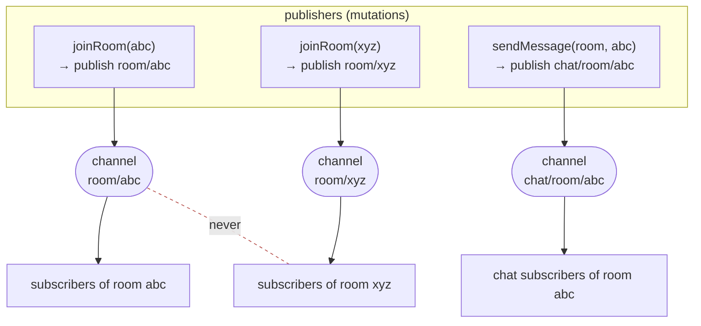
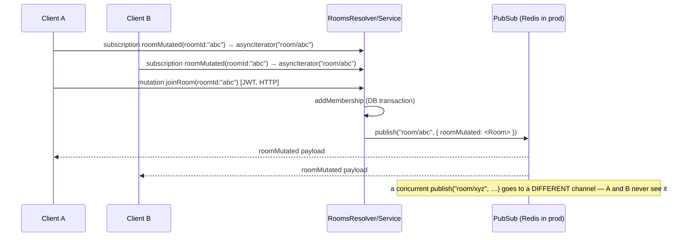
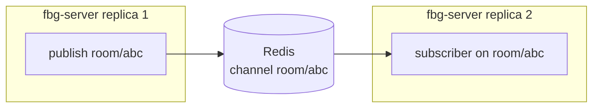

# 3 · Realtime & Pub/Sub — "the queues"

_[← 2 · fbg-server](02-fbg-server.md) · [Index](00-README.md) · Next: [4 · boardgame.io & socket.io →](04-boardgameio-sockets.md)_

> **The question this chapter answers:** *"How do we make sure we don't get confused between different sockets when using queues?"* — for the **lobby/chat** realtime (fbg-server). The game-move realtime is [Ch.4](04-boardgameio-sockets.md).
>
> **First, two corrections:**
> 1. **There are no queues.** No Bull, BullMQ, Agenda, bee-queue, cron, or worker threads anywhere in `fbg-server` (verified by exhaustive search). What you may have heard called "queues" is **Redis Pub/Sub**.
> 2. **Pub/Sub is not a queue.** It is **fire-and-forget broadcast fan-out** — no durability, no acknowledgements, no consumer groups, no persistence. If a subscriber is offline, the message is simply gone. We use it purely to push live updates to connected GraphQL subscribers.

---

## 3.1 What is realtime here?

`fbg-server` pushes three kinds of live update to the browser over **GraphQL subscriptions** (WebSocket, `subscriptions-transport-ws`):

| Subscription | Fires when… | Channel topic |
|---|---|---|
| `roomMutated(roomId)` | a room's membership/positions/capacity change, or a match starts | `room/{roomId}` |
| `lobbyMutated` | a **public** room is created/updated (lobby listing changes) | `lobby` |
| `chatMutated(channelType, channelId)` | a chat message is sent to a room or match | `chat/{channelType}/{channelId}` |

The transport is GraphQL-over-WebSocket; the **fan-out engine behind it** is a `PubSub` instance. Which `PubSub` you get depends on the environment.

---

## 3.2 The PubSub engine: dev vs prod (one swap point)

Everything funnels through a single DI provider, `FBG_PUB_SUB`, built by a factory that branches on `NODE_ENV`:

```ts
// fbg-server/src/internal/FbgPubSubModule.ts  (token 'FbgPubSub', useFactory ~lines 13-27)
if (process.env.NODE_ENV === 'production') {
  const options = {
    host: process.env.FBG_REDIS_HOST,
    port: parseInt(process.env.FBG_REDIS_PORT),
    password: process.env.FBG_REDIS_PASSWORD,
  };
  return new RedisPubSub({
    publisher: new Redis(options),    // ioredis client #1
    subscriber: new Redis(options),   // ioredis client #2
  });
}
return new PubSub();                  // in-memory (graphql-subscriptions)
```

- **Production → `RedisPubSub`** (`graphql-redis-subscriptions`) with **two** ioredis connections. Two are required because a Redis connection in `SUBSCRIBE` mode can't also issue normal commands — one client publishes, the other subscribes.
- **Dev / non-prod → in-memory `PubSub`** (`graphql-subscriptions`). Single process only.
- Resolvers/services never see this choice — they inject the `FBG_PUB_SUB` token and call `.publish()` / `.asyncIterator()`.

> ⚠️ **Reality check — dev pub/sub doesn't cross processes.** The in-memory `PubSub` lives inside one Node process. If you ran **more than one** non-prod replica, cross-replica events would silently vanish. This is fine for single-instance dev, but it's exactly why **production uses Redis** (see §3.6).

---

## 3.3 The isolation mechanism: topic namespacing by entity id

**This is the heart of "don't confuse different sockets."** There is **no filtering logic, no per-connection routing table, and no `filter` function anywhere.** Isolation is purely **structural**: every channel name embeds the id of the entity it belongs to, and a subscriber only ever listens on the one channel for its entity.

```ts
// Subscriber side — rooms.resolver.ts:108-113
@Subscription(() => Room)
roomMutated(@Args({ name: 'roomId', type: () => String }) roomId: string) {
  return this.pubSub.asyncIterator(`room/${roomId}`);   // listens ONLY on room/<that id>
}

// Publisher side — rooms.service.ts:217-221
async notifyRoomUpdate(room: RoomEntity): Promise<void> {
  await this.pubSub.publish(`room/${room.id}`, { roomMutated: roomEntityToRoom(room) });
}
```

Because Redis/PubSub fan-out is **per channel name**, an event published to `room/abc` is delivered to *exactly* the subscribers that called `asyncIterator('room/abc')` — never to `room/xyz`.



Two more details that make it watertight:

1. **The payload key must match the subscription field.** `{ roomMutated: … }`, `{ lobbyMutated: … }`, `{ chatMutated: … }` — `graphql-subscriptions` uses that key to route the payload to the correct resolver field. Publish the wrong key and the subscriber receives nothing.
2. **Chat is namespaced by *type and* id** — `chat/{channelType}/{channelId}` (`fbg-server/src/chat/chat.service.ts:61-65`, `chat.resolver.ts:31-46`). So `chat/room/abc` and `chat/match/abc` are **different** channels: a room's chat can't bleed into the match's chat even when they share an id. Subscription args are validated first — `channelType` must be in `VALID_CHANNEL_TYPES = {room, match}` and `channelId` non-empty (`chat.resolver.ts:33-44`), so a client can't subscribe to a malformed or wildcard channel.

**There is deliberately no `user/{id}` channel.** When a user changes their nickname, the change is re-broadcast to **every room they're a member of** by looping rooms and calling `notifyRoomUpdate` (`fbg-server/src/rooms/rooms.service.ts:210-215`). It reuses the `room/{id}` channels rather than adding a per-user one.

---

## 3.4 End-to-end: a room update



The same shape applies to `chat/{type}/{id}` and `lobby`. The publish always happens **after** the database write commits, so subscribers receive state that's already durable.

---

## 3.5 ⚠️ Subscriptions are unauthenticated (know this)

Authorization in `fbg-server` is enforced on the **write path** (mutations check membership/ownership), **not** on the subscribe path:

- No `@UseGuards(GqlAuthGuard)` on any `@Subscription`.
- The Apollo subscription setup has **no `onConnect`/`connectionParams`** handler, so the JWT is never read at WebSocket connect time. (The GraphQL context is `({ req }) => ({ req })`, and subscriptions have no `req`.)
- Net effect: **anyone who knows a `roomId`/`matchId` can subscribe** and receive its live payloads. Those ids are `shortid`s, so confidentiality rests on **unguessability**, not on tokens.

This is a reasonable trade-off for a casual board-game lobby, but document it for anyone tempted to put sensitive data on these channels. The dead `SubscriptionAuth.ts` ([Ch.2 §2.3](02-fbg-server.md)) hints this was meant to be tightened.

---

## 3.6 Why this scales horizontally (and the cost)

- **Across replicas:** with `RedisPubSub`, a `publish('room/abc')` on **replica 1** is delivered to a subscriber whose WebSocket terminates on **replica 2**, because both share the same Redis. This is the entire reason production uses Redis instead of the in-memory engine — it's what lets you run `replicas.fbgServer > 1`.
- **WebSocket pinning:** a given subscription's socket must stay on the replica that terminated it (true of any WebSocket), but **event delivery is replica-independent** thanks to Redis. So no special routing is needed beyond normal connection stickiness.
- **The cost / ceiling:** Redis is a **single standalone instance** (`redis.architecture: standalone`) and a single point of failure; every published event fans through it. It is one of the two scaling bottlenecks (the other is Postgres). See [Ch.5](05-scaling-clustering.md).



---

## 3.7 Takeaways

1. **No queues** — it's **Redis Pub/Sub**, a fire-and-forget broadcast bus.
2. **One swap point** (`FbgPubSubModule.ts`): in-memory in dev, Redis in prod.
3. **Isolation = topic namespacing by id** (`room/{id}`, `chat/{type}/{id}`, `lobby`) — no filters, no routing tables. Different ids = different channels = no cross-talk.
4. The **payload key** must equal the subscription field name.
5. **Subscriptions are unauthenticated**; confidentiality relies on id unguessability.
6. Redis makes it **horizontally scalable**, at the cost of being a **single-instance bottleneck**.

_[← 2 · fbg-server](02-fbg-server.md) · [Index](00-README.md) · Next: [4 · boardgame.io & socket.io →](04-boardgameio-sockets.md)_
