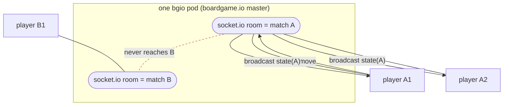
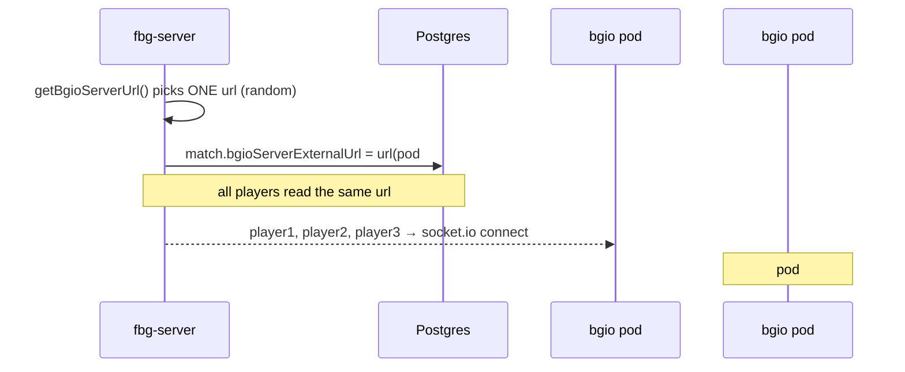

# 4 · boardgame.io & socket.io — the realtime game server

_[← 3 · Realtime & pub/sub](03-realtime-pubsub.md) · [Index](00-README.md) · Next: [4b · FBG vs boardgame.io →](04b-fbg-vs-boardgameio.md)_

> **The question this chapter answers:** *"How do we use clusters with socket.io, and how do we make sure we don't get confused between different sockets?"* — for **live gameplay**. The lobby/chat side was [Ch.3](03-realtime-pubsub.md).
>
> 🎯 **Diagram:** [`diagrams/03-socket-match-pinning.drawio`](diagrams/03-socket-match-pinning.drawio).

`bgio` is the **boardgame.io** server. It is the only place socket.io exists in FBG. It runs the authoritative game reducer, persists state to Postgres, and broadcasts state updates to the players of a match. It is booted from the **web image** with `SERVER_TYPE=BGIO` ([Ch.1 §1.1](01-architecture-overview.md)).

**Versions:** boardgame.io `0.49.11`, socket.io server `4.4.1`, `@boardgame.io/redis-pubsub` `0.0.1`, `bgio-postgres` `^1.0.13`.

---

## 4.1 How bgio boots

```ts
// web/server/bgio.ts (key lines)
import { Server, SocketIO } from 'boardgame.io/server';   // :10
import { PostgresStore } from 'bgio-postgres';            // :11
const PORT = parseInt(process.env.BGIO_PORT || '8001');   // :13

function getDb()        { return process.env.POSTGRES_URL ? new PostgresStore(process.env.POSTGRES_URL) : undefined; }  // :15-21
function getTransport() { /* redis env set? */ return new SocketIO({ pubSub: new RedisPubSub(pub, sub) }); /* else undefined */ }  // :27-32

const origins = process.env.BGIO_PUBLIC_SERVERS || 'http://localhost';  // :39
const server  = Server({ games, db: getDb(), origins, transport: getTransport() });  // :40
server.app.use(cors()); server.app.use(noCache);  // :41-42 (Koa middleware)
server.run(PORT);  // :43
```

- **socket.io is provided by boardgame.io**, not constructed directly. FBG only customizes the transport to inject a pub/sub (see §4.5). With no Redis env, `getTransport()` returns `undefined` and boardgame.io falls back to its default socket.io transport with **in-memory** pub/sub.
- **Path** is the socket.io default `/socket.io/` (this is why the Ingress routes `/socket.io/` to bgio).
- **Origins/CORS**: `origins` comes from `BGIO_PUBLIC_SERVERS` (boardgame.io app-level allowlist) plus Koa `cors()`.
- **State store**: `PostgresStore` when `POSTGRES_URL` is set; otherwise boardgame.io's in-memory default. The store is shared with `fbg-server`'s Postgres.

---

## 4.2 Isolation mechanism #1 — `matchID` socket.io rooms (the library's job)

boardgame.io keeps games apart by **`matchID`**, and FBG relies on that rather than implementing rooms itself:

- The browser passes `matchID` into boardgame.io's React `Client` (`web/src/infra/game/Game.tsx:45,63`, `matchCode = props.match?.bgioMatchId`).
- boardgame.io's socket.io **master** joins each connected client into a **socket.io room named after the `matchID`**.
- On a move, the master applies it to **that match's** reducer, persists the new state via the `db`, and **broadcasts the result only to the room for that `matchID`**.

So a move in match `A` is emitted to match `A`'s room only; match `B`'s sockets never receive it. **FBG's only job in this isolation is handing each player the correct `matchID` + per-player credentials** so they join the right room with the right identity (`bgioMatchId`, `bgioSecret`, `bgioPlayerId`, minted at join in `fbg-server/src/match/match.service.ts:187-198`, delivered via the `GetMatch` GraphQL query `web/src/infra/common/services/LobbyService.ts:74-89`).



---

## 4.3 Isolation mechanism #2 — match → pod pinning (FBG's job)

Rooms keep matches apart **within** one pod. But with multiple bgio pods, you also need every player of a match to land on the **same** pod (otherwise two pods each hold half a match and must reconcile over the relay). FBG solves this by **pinning each match to one pod at creation time**:

1. When `fbg-server` starts a match, `getBgioServerUrl()` picks **one** server from a comma-separated list and persists it on the match row (`fbg-server/src/match/MatchUtil.ts:39-53`, `match.service.ts:117,128-129`):
   - `bgioServerInternalUrl` — used server-to-server for create/join.
   - `bgioServerExternalUrl` — handed to the browser.
2. **Every player** of that match receives the **same** `bgioServerUrl` via GraphQL (`MatchUtil.ts:18`), so they all open socket.io to the **same** bgio instance.

This is **routing, not broadcasting** — the cleanest way to "not confuse sockets across pods" is to make sure a match's sockets are never split across pods in the first place.



> ⚠️ **Reality check — pinning is a *latent* capability in the default chart.** The Helm chart wires **single** values: `BGIO_PRIVATE_SERVERS = http://{release}-bgio` (the **Service** name) and `BGIO_PUBLIC_SERVERS = https://{domain}` (`helm/templates/fbg-server-deployment.yaml:24-27`). With one entry, the "random pick" always resolves to the **ClusterIP Service**, which round-robins **per TCP connection** across bgio pods. So with `replicas.bgio > 1` and the default values, players of a match are **not** guaranteed the same pod by pinning — they're kept together by the **ingress cookie affinity** instead (§4.6). To get true per-match pod pinning, populate `BGIO_PRIVATE_SERVERS`/`BGIO_PUBLIC_SERVERS` with **per-pod addresses** — the code already supports the comma-split; the default chart simply doesn't wire it.

---

## 4.4 Isolation mechanism #3 (backstop) — `@boardgame.io/redis-pubsub`

If two pods *do* end up holding sockets for the same match (e.g. round-robin split, or a reconnect that lands elsewhere), they must agree on state. That's what the relay is for:

```ts
// web/server/bgio.ts:32
return new SocketIO({ pubSub: new RedisPubSub(pub, sub) });
```

- `@boardgame.io/redis-pubsub` plugs into **boardgame.io's own `pubSub` interface**. When the master on pod 1 applies a move, it publishes the state delta to Redis; pod 2 (holding other sockets for the same `matchID`) receives it and broadcasts to its local room members. Still scoped by `matchID`.

> ⚠️ **Critical correction:** this is **NOT** a socket.io Redis adapter. There is **no `socket.io-redis` / `@socket.io/redis-adapter`** anywhere in the repo or lockfiles. The relay operates at the **boardgame.io application layer** (state deltas keyed by matchID), not at the **socket.io broadcast layer** (raw room emits). If you go looking for "the socket.io adapter," you won't find one — and you shouldn't add one without understanding that boardgame.io already relays at a higher level.

---

## 4.5 State persistence — shared Postgres

```ts
// web/server/bgio.ts:11,15-21,40
import { PostgresStore } from 'bgio-postgres';
const db = process.env.POSTGRES_URL ? new PostgresStore(process.env.POSTGRES_URL) : undefined;
const server = Server({ games, db, origins, transport });
```

- Match state (the boardgame.io `State` and `log`) is written to the **same PostgreSQL** that `fbg-server` uses (different tables, e.g. `Games`). Helm wires the same `POSTGRES_URL` to both (`helm/templates/{bgio,fbg-server}-deployment.yaml`).
- Because state is in **shared Postgres**, any bgio pod *can* reconstruct a match — the live-socket fan-out (rooms + redis relay) is the only thing that's pod-local. This is what makes horizontal scale possible at all.
- If `POSTGRES_URL` is unset, boardgame.io uses an **in-memory FlatFile** store — fine for local dev, useless across pods.

---

## 4.6 How the browser connects

The client uses boardgame.io's **`SocketIO` multiplayer transport**, pointed at the **per-match** URL:

```ts
// web/src/infra/game/hooks/useConfigBuilder.tsx:100-106
// for GameMode.OnlineFriend:
return SocketIO({ server: serverUrl });     // serverUrl = match.bgioServerUrl (Game.tsx:47)
// (AI mode uses Local({...}) — no network)
```

- `serverUrl` is **per-match data from fbg-server**, derived from `BGIO_PUBLIC_SERVERS` and returned by the `GetMatch` GraphQL query — it is **not** a static client config.
- In prod that URL is `https://{domain}`, so the socket.io connection enters via the Ingress `/socket.io/` route.

**socket.io v4 + stickiness:** socket.io v4 starts with HTTP long-polling and *upgrades* to WebSocket; the upgrade handshake **must** hit the same backend pod. With no socket.io Redis adapter, a naive round-robin would break that handshake across pods. FBG keeps the connection pinned with the Ingress **cookie affinity** on `/socket.io/` (`helm/templates/ingress.yaml`, bgio Service itself has `sessionAffinity: None`). Detail in [Ch.5](05-scaling-clustering.md).

---

## 4.7 The full gameplay loop

```mermaid
sequenceDiagram
    participant C as Browser (boardgame.io Client)
    participant IG as Ingress (/socket.io/, cookie affinity)
    participant G as bgio pod (boardgame.io master)
    participant DB as Postgres (PostgresStore)
    participant RED as Redis (boardgame.io relay)
    C->>IG: socket.io connect to bgioServerUrl (matchID, credentials)
    IG->>G: routed to pinned/sticky pod; join room = matchID
    C->>G: makeMove(...)
    G->>G: apply move to match reducer (authoritative)
    G->>DB: persist new State + log
    G-->>C: broadcast new state to room = matchID (all players)
    G-->>RED: publish delta (if other pods hold this match's sockets)
    RED-->>G: other pods rebroadcast to their local room members
```

---

## 4.8 Takeaways

1. **socket.io lives only in bgio** (boardgame.io), booted from the web image via `SERVER_TYPE=BGIO`.
2. **Isolation is layered:** (1) boardgame.io `matchID` socket.io rooms, (2) FBG **match→pod pinning**, (3) `@boardgame.io/redis-pubsub` relay as a cross-pod backstop.
3. **There is no socket.io Redis adapter** — the relay is at the boardgame.io layer, keyed by `matchID`.
4. **State is shared in Postgres**, which is what permits more than one bgio pod.
5. The browser connects to a **per-match server URL** assigned by `fbg-server`; **cookie affinity** keeps the socket.io connection pinned (required by socket.io v4's upgrade).
6. ⚠️ With default Helm values, **per-match pinning is latent** (single Service URL) — stickiness is doing the real work; wire per-pod URLs to activate true pinning.

_[← 3 · Realtime & pub/sub](03-realtime-pubsub.md) · [Index](00-README.md) · Next: [4b · FBG vs boardgame.io →](04b-fbg-vs-boardgameio.md)_
