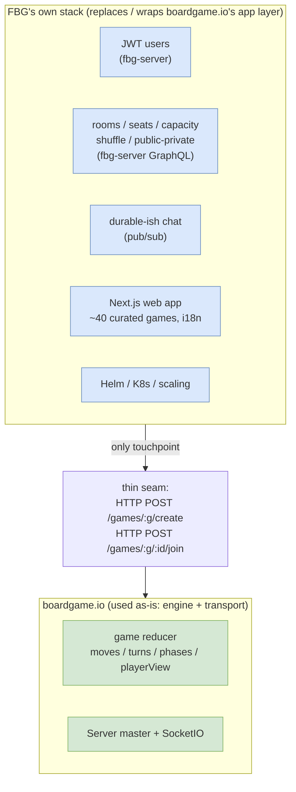

# 4b · FBG vs. vanilla boardgame.io

_[← 4 · boardgame.io & socket.io](04-boardgameio-sockets.md) · [Index](00-README.md) · Next: [5 · Scaling & clustering →](05-scaling-clustering.md)_

> **Why this chapter exists:** boardgame.io is a full open-source framework — it ships a game engine, a server, **and** a lobby/matchmaking system. FBG uses the engine, **but replaces almost everything around it.** If you read the [boardgame.io docs](https://boardgame.io/documentation/) expecting FBG to work like a stock boardgame.io app, you'll be confused — this chapter maps exactly what carries over and what doesn't.
>
> **Upstream is OSS:** library at [github.com/boardgameio/boardgame.io](https://github.com/boardgameio/boardgame.io), docs at [boardgame.io/documentation](https://boardgame.io/documentation/). FBG pins **`boardgame.io@0.49.11`**.

---

## 4b.1 The one-sentence relationship

**FBG uses boardgame.io as a headless game-state engine + realtime sync transport, and rebuilds matchmaking, identity, persistence, chat, and deployment as its own stack.** boardgame.io is poked only through **two low-level HTTP endpoints** (`create` + `join`); everything a player experiences *around* the game is FBG's own code.



---

## 4b.2 What FBG uses **as-is** (read the boardgame.io docs for these)

These work in FBG exactly as the upstream docs describe — when touching them, the [boardgame.io API reference](https://boardgame.io/documentation/#/api/Game) is authoritative:

| boardgame.io feature | How FBG uses it | Evidence |
|---|---|---|
| **`Game` object** (`setup`, `moves`, `turn`, `phases`, `stages`, `endIf`, `playerView`) | Every game under `web/src/games/*/game.ts` exports a standard `Game<IG>`. E.g. `mergers/game.ts:470` uses phases + stages; `tictactoe/game.ts` is minimal. | per-game `game.ts` |
| **`boardgame.io/core`** (`INVALID_MOVE`, `TurnOrder`, `Stage`, `ActivePlayers`, `PlayerView`) | Used directly in game logic. `PlayerView.STRIP_SECRETS` for hidden info (~8 games). | `mergers/game.ts:1,473-475` |
| **React `Client`** | Wrapped, not replaced — `Client(config)` then mounted with `matchID`/`playerID`/`credentials`. | `web/src/infra/game/Game.tsx:62-63` |
| **`SocketIO` multiplayer transport** (client) | Online play: `SocketIO({ server: serverUrl })`. | `web/src/infra/game/hooks/useConfigBuilder.tsx:100-107` |
| **`Local` transport + bots** | AI play: `Local({ bots: { '0': gameAIType } })`. Bots are **client-side only** in 0.49 (no server bots). | `useConfigBuilder.tsx` |
| **`MCTSBot` / `RandomBot`** (`boardgame.io/ai`) | Per-game `ai.ts` returns `{ type: MCTSBot, ai: { enumerate } }` or a `RandomBot`. | `tictactoe/ai.ts:2` |
| **`Debug` panel** (`boardgame.io/debug`) | Opt-in per game via `config.debug`. | `useConfigBuilder.tsx:2,50-52` |
| **`setupData`** | Game customization is JSON-passed through to bgio's standard `setupData`. | `LobbyService.ts:103-111` → `match.service.ts:160-164` |
| **`BoardProps`, `isConnected`, secret state** | Board components consume standard bgio props. | `GameBoardWrapper.tsx:7,28` |

---

## 4b.3 What FBG **replaces or overrides**

This is where FBG diverges from a stock boardgame.io app. **Most of these exist because FBG needed identity, durable rooms, and horizontal scale — none of which boardgame.io provides ([§4b.5](#4b5-what-vanilla-boardgameio-does-not-provide)).**

### ① The Lobby — *entirely replaced* (the headline)

Vanilla boardgame.io ships a **Lobby**: a REST API (`GET /games`, `POST /games/:name/create`, `…/join`, `…/leave`, `…/playAgain`), a `LobbyClient` (`boardgame.io/client`), and a React `<Lobby>` component. **FBG uses none of it** — there are **zero** `LobbyClient` / `<Lobby>` references in the codebase.

Instead, matchmaking is a **NestJS GraphQL** system in `fbg-server`:

- **Rooms** (`fbg-server/src/rooms/`) — seats, capacity, creator, public/private, position, shuffle, "kick", lobby listing. None of this exists upstream.
- **Match** (`fbg-server/src/match/`) — match lifecycle, "play again" chaining (FBG-native, not bgio's `/playAgain`).
- The browser talks to this via Apollo GraphQL.

> ⚠️ **Gotcha:** `web/src/infra/common/services/LobbyService.ts` is **not** boardgame.io's `LobbyClient` — despite the name, it's an **Apollo GraphQL client** pointed at `fbg-server` (`LobbyService.ts:25-27`). When you read "lobby" in FBG, think *FBG's GraphQL lobby*, not boardgame.io's.

### ② Create/Join — *server-to-server*, not browser-driven

In a vanilla app the **browser's** `LobbyClient` calls `/create` and `/join`. FBG inverts this: **`fbg-server` is the only caller** of bgio's REST API, and the browser never touches it.

```ts
// fbg-server/src/match/match.service.ts
.post(`${bgioServerUrl}/games/${room.gameCode}/create`, { numPlayers: room.capacity, setupData })  // :162
//   → returns { matchID }                                                                          // :167
.post(`${match.bgioServerInternalUrl}/games/${match.gameCode}/${match.bgioMatchId}/join`,
      { playerID, playerName })                                                                      // :194
//   → returns { playerCredentials }                                                                 // :198 (one call per player, serial)
```

FBG also **ignores `/leave` and `/playAgain`** — leaving and "play again" are handled in FBG's own room model (`getNextRoom`, `match.service.ts:59-84`).

### ③ Storage — `bgio-postgres`, not the default

boardgame.io defaults to an **in-memory** store (or bundled `FlatFile`) and ships **no** database adapter. FBG plugs in the community **`bgio-postgres`** `PostgresStore` for durable, multi-pod match state (`web/server/bgio.ts:11,20`). Note this is a **separate** database concern from `fbg-server`'s own TypeORM tables (rooms/users/matches metadata) — two schemas, both in the shared Postgres.

### ④ Transport — Redis-pubsub SocketIO + Koa middleware

FBG swaps bgio's default in-process SocketIO for `SocketIO({ pubSub: new RedisPubSub(...) })` (`bgio.ts:32`) so multiple bgio pods can relay state ([Ch.4 §4.4](04-boardgameio-sockets.md)), and adds `koa-no-cache` + `@koa/cors` to the Koa app (`bgio.ts:41-42`). *(Reminder: `@boardgame.io/redis-pubsub` is a boardgame.io-layer relay, **not** a socket.io adapter.)*

### ⑤ Credentials — brokered through authenticated GraphQL

boardgame.io returns `playerCredentials` from `join` and a vanilla app stores them in the **browser/localStorage**. FBG keeps bgio's default credential model but **persists the credential server-side** (`MatchMembershipEntity.bgioSecret`) and returns it through **authenticated GraphQL** — and only ever your *own* secret (`MatchUtil.ts:24-30`). The bgio credential becomes a derived secret gated behind FBG's JWT auth ([Ch.2 §2.3](02-fbg-server.md)).

### ⑥ Game registry — codegen, not a hand-written array

A vanilla app passes a hand-written `games: [GameA, GameB]` array. FBG **auto-generates** `web/src/games/index.ts` (`GAMES_LIST`) via `cli/codegen/genGames.js`, and wraps each game in a two-layer **`IGameDef` (metadata) + lazy `IGameConfig`/`IAIConfig`** envelope so one declaration feeds the client (code-split `import()`), the bgio server, and marketing pages.

### ⑦ Online seed override

For online matches FBG overrides `seed: Math.random()` (`useConfigBuilder.tsx:37`) instead of bgio's `Date.now()`-based default — a deliberate fix for "strange" card distributions.

---

## 4b.4 What FBG **adds** that vanilla boardgame.io has no answer for

| FBG capability | Vanilla boardgame.io |
|---|---|
| **User accounts / identity** (nickname + never-expiring JWT) | ❌ only per-match credential tokens, no users |
| **Durable rooms** (seats, capacity, positions, shuffle, public/private, creator, kick, lobby listing) | ❌ Lobby lists all matches globally; no room model |
| **Chat** (per room/match, bad-words filtered) | ⚠️ ephemeral chat only, not persisted by the server |
| **GraphQL API + subscriptions** | ❌ REST Lobby only |
| **"Play again" room chaining** | ⚠️ only a flat `/playAgain` follow-up match |
| **Production deployment & horizontal scale** (Helm, K8s, sticky sessions, match→pod pinning, backups) | ❌ docs cover single-instance Heroku only; no scaling guidance |
| **Authorization** (JWT-guarded mutations, membership checks) | ❌ nothing beyond match credentials |
| **Curated catalog** (~40 games, i18n, customization UI, SSR site) | ❌ framework only |

---

## 4b.5 What vanilla boardgame.io does NOT provide

Per the [upstream docs](https://boardgame.io/documentation/), out of the box boardgame.io has **no**: persistent user accounts, durable chat ([chat is explicitly ephemeral](https://boardgame.io/documentation/#/chat)), production database adapter (Postgres/Firebase are community packages), horizontal-scaling/sticky-session guidance, K8s/Helm tooling, GraphQL, authorization beyond match credentials, or an opinionated lobby UX (the React `<Lobby>` is a minimal match-list + join form — no room codes, invites, or friends). **Every item in [§4b.4](#4b4-what-fbg-adds-that-vanilla-boardgameio-has-no-answer-for) is FBG filling one of these gaps.**

---

## 4b.6 Feature-mapping cheat sheet

| Concern | Vanilla boardgame.io | FBG | Evidence |
|---|---|---|---|
| Game engine (moves/turns/phases/secret state) | ✅ core | ✅ **used as-is** | `web/src/games/*/game.ts` |
| Client / board / transports | ✅ `Client`, `SocketIO`, `Local` | ✅ **wrapped** | `Game.tsx`, `useConfigBuilder.tsx` |
| Bots (MCTS/Random) | ✅ client-side | ✅ **used as-is** (per-game `ai.ts`) | `tictactoe/ai.ts` |
| Lobby / matchmaking | ✅ `LobbyClient` + `<Lobby>` + REST | ❌ **replaced** by GraphQL rooms/match | `fbg-server/src/{rooms,match}` |
| create / join | browser `LobbyClient` | **server→server** axios | `match.service.ts:162,194` |
| leave / playAgain | bgio REST | ❌ **FBG-native** room model | `match.service.ts:59-84` |
| Storage | InMemory / FlatFile | **`bgio-postgres`** | `bgio.ts:11,20` |
| Transport internals | default SocketIO | **redis-pubsub SocketIO** + Koa mw | `bgio.ts:32,41-42` |
| Credentials | browser localStorage | **server-side + JWT GraphQL** | `MatchUtil.ts:24-30` |
| Game registry | hand-written array | **codegen `GAMES_LIST`** | `cli/codegen/genGames.js` |
| Online seed | `Date.now()` | **`Math.random()` override** | `useConfigBuilder.tsx:37` |
| Identity / chat / authz / scaling | ❌ none | ✅ **FBG adds all** | [Ch.2](02-fbg-server.md), [Ch.5](05-scaling-clustering.md) |

---

## 4b.7 Reading boardgame.io's docs as an FBG engineer

- ✅ **Trust the docs for:** the `Game` object, moves/turns/phases/stages, `playerView`/secret state, `Client`/board props, bots, `setupData`. ([API ref](https://boardgame.io/documentation/#/api/Game))
- 🚫 **Ignore for FBG:** the **Lobby** (`LobbyClient`, `<Lobby>`, the `/games` listing), browser-side `create`/`join`, and the localStorage credential flow — FBG does all of this through `fbg-server` GraphQL.
- ⚠️ **Watch out for:**
  - `LobbyService` in FBG ≠ boardgame.io `LobbyClient` (it's Apollo GraphQL).
  - Bots only run with `Local()` (AI mode) — there are no server-side bots online.
  - Online seeding is overridden (`Math.random()`), so don't expect bgio's default `Date.now()` seed.
  - Match credentials reach the client via your *own* `bgioSecret` over GraphQL, gated by JWT — not from a `joinMatch` call.
  - boardgame.io's docs assume single-instance; FBG's scaling story is [Ch.4](04-boardgameio-sockets.md)/[Ch.5](05-scaling-clustering.md), not upstream.

> **Want to see the lobby-light alternative?** The experimental `/v2` rewrite (`v2/fbg-bgio`, `v2/fbg-web`) mounts boardgame.io much closer to vanilla (static game registry, Client in route pages, no GraphQL lobby). It's **not** production, but it's a useful contrast to how `web/` wraps the library.

---

## 4b.8 Takeaways

1. **boardgame.io = engine + transport only.** FBG keeps the game model, Client, bots, and SocketIO sync.
2. **The Lobby is entirely FBG's** — GraphQL rooms/match in `fbg-server`, not boardgame.io's `LobbyClient`/`<Lobby>`.
3. **The only bgio API seam is server-side `create` + `join` over HTTP.**
4. FBG **adds** identity, durable rooms, chat, authz, and production scaling — all things vanilla boardgame.io doesn't ship.
5. When in doubt: **upstream docs for in-game logic; FBG's GraphQL for everything around the game.**

_[← 4 · boardgame.io & socket.io](04-boardgameio-sockets.md) · [Index](00-README.md) · Next: [5 · Scaling & clustering →](05-scaling-clustering.md)_
