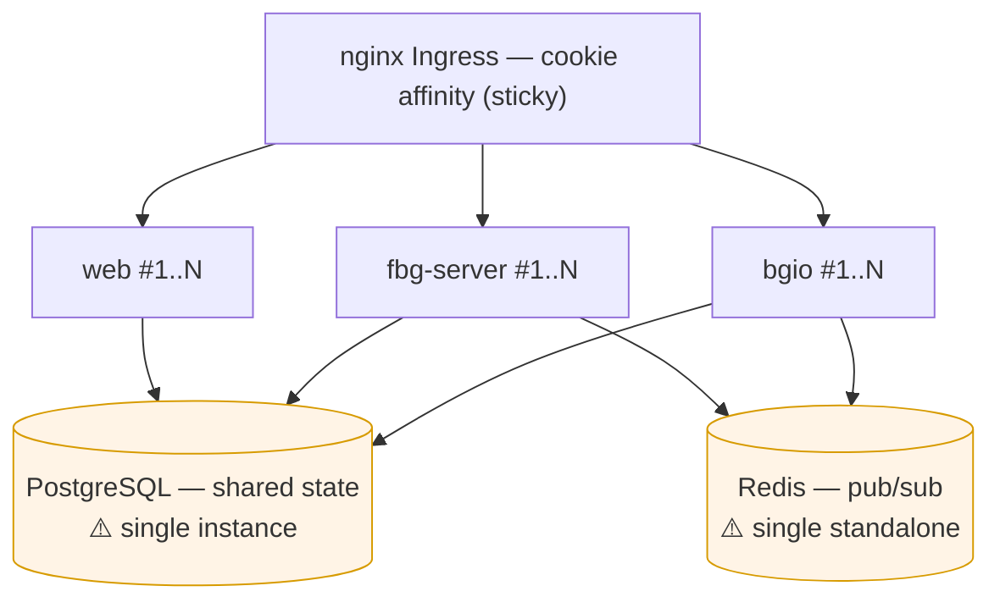

# 5 · Scaling & Clustering

_[← 4 · boardgame.io & socket.io](04-boardgameio-sockets.md) · [Index](00-README.md) · Next: [6 · DevOps & deployment →](06-devops-deployment.md)_

> **The question this chapter answers:** *"How did we scale FBG for large traffic?"* — honestly. The architecture is **built to scale horizontally**, but the **public chart ships single-replica with several gaps**. This chapter separates the three: what's **configured**, what's **designed-for**, and what's **missing**.
>
> 🏗️ **Diagram:** [`diagrams/04-deployment-topology.drawio`](diagrams/04-deployment-topology.drawio).

---

## 5.1 The scaling model in one picture

The three app tiers are **stateless** (no in-memory cross-request state that matters), so each can be replicated independently. Coordination happens through **shared Postgres** (durable state) and **Redis** (live fan-out). The two datastores are the scaling ceiling.

| Tier | How it scales out | What keeps it correct across replicas |
|---|---|---|
| **web** | bump `replicas.web` | Stateless SSR; nothing to coordinate. |
| **fbg-server** | bump `replicas.fbgServer` | **Redis pub/sub** delivers subscription events across replicas ([Ch.3](03-realtime-pubsub.md)). |
| **bgio** | bump `replicas.bgio` | **matchID rooms** + **match→pod pinning** + **ingress cookie affinity** + **redis-pubsub relay** + **shared Postgres state** ([Ch.4](04-boardgameio-sockets.md)). |

---

## 5.2 Sticky sessions — the one piece WebSockets require

Stateless tiers can be load-balanced freely **except** for long-lived WebSockets:

- A **GraphQL subscription** socket must stay on the fbg-server replica that terminated it (delivery is still cross-replica via Redis, so this is just connection-level, not routing).
- A **socket.io** connection must stay on one bgio pod because **socket.io v4 upgrades** from long-polling to WebSocket and the upgrade handshake must hit the same backend.

FBG provides this with **one** mechanism: the nginx Ingress annotation `nginx.ingress.kubernetes.io/affinity: cookie` (`helm/templates/ingress.yaml`). The bgio **Service** itself is `sessionAffinity: None` — stickiness lives at the **ingress**, not the Service.

> ⚠️ **Reality check — the cookie affinity is ingress-wide.** It's set on the whole Ingress object, not scoped to `/socket.io/`, so it applies to all paths. Harmless, but know it. There are **no explicit `proxy-read-timeout`/`proxy-send-timeout`** annotations, so idle WebSockets rely on the nginx-ingress default (~60s read timeout) plus socket.io's own heartbeat to stay alive — a latent reliability detail for very idle connections.

---

## 5.3 Shared state & the connection-pool multiplier

- **Postgres** holds both lobby data (fbg-server/TypeORM) and game state (bgio/PostgresStore). It is **one shared instance**.
- **Redis** is **pub/sub only** — two independent uses ([Ch.3](03-realtime-pubsub.md) and [Ch.4 §4.4](04-boardgameio-sockets.md)). No cache, no sessions, no queue.
- **Connection math to remember:** `fbg-server` sets a Postgres pool `extra.max = 22` per replica (`fbg-server/src/app.module.ts:18`). Total Postgres connections ≈ `22 × replicas.fbgServer` + bgio's pool + the backuper. **Size Postgres `max_connections` against the replica count** before scaling fbg-server up, or you'll exhaust connections before CPU.

---

## 5.4 What is actually configured today

From the Helm chart (`helm/values.yaml`, `helm/templates/*`):

| Setting | Default in repo | Notes |
|---|---|---|
| `replicas.web` / `replicas.fbgServer` / `replicas.bgio` | **1 / 1 / 1** | Single pod per tier unless overridden. |
| Resource requests | `cpu: 100m`, `memory: 128Mi` each | **No limits** on any container. |
| Liveness probes | web `/en`, bgio `/games`, fbg-server `/healthz` (deep) | Present on all three. |
| Readiness probes | **none** | Traffic can hit a not-yet-ready pod during rollout. |
| Rolling update | web & fbg-server `maxSurge 100% / maxUnavailable 25%`; bgio `25% / 25%` | Zero-downtime intent. |
| Redis | `architecture: standalone` | No HA/replicas/sentinel. |
| Postgres | Bitnami 9.8.9 subchart, single instance | No replication configured in-repo. |
| TLS | cert-manager + Let's Encrypt | Automated. |
| Backups | daily `pg_dump` → GCS | [Ch.6](06-devops-deployment.md). |

> ⚠️ **The honest headline:** as shipped in this repo, FBG is a **single-replica-per-tier, single-Postgres, single-Redis** deployment. The horizontal-scale machinery (pub/sub, sticky sessions, match pinning, shared state) is **built and correct**, but **dormant at `replicas: 1`**. Real production replica counts (and any tuned values) live in a **private `secrets/values.prod.yaml`** referenced by `misc/fbg-autoupdate/README` — they are **not visible in this repo**, so treat "scaled for large traffic" as **architecturally enabled, not demonstrably configured here**.

---

## 5.5 🔮 Designed-for, not yet switched on

These work the moment you turn them on — the code already supports them:

- **Horizontal replicas** for all three tiers (just raise the `replicas.*` values).
- **Cross-replica subscription delivery** (already on in prod via Redis).
- **Per-match bgio pod pinning** — *latent*: the match-assignment code reads a comma-separated `BGIO_PRIVATE_SERVERS`/`BGIO_PUBLIC_SERVERS` and picks one at random, but the default chart wires a **single Service URL**. Populate those with **per-pod addresses** to activate true pinning ([Ch.4 §4.3](04-boardgameio-sockets.md)).

---

## 5.6 ⚠️ Gaps & the scaling roadmap

Onboarding truth: here's what a new engineer should know is **missing**, why it matters, and the fix. None of these are wired in the repo (verified by searching `helm/`).

| Gap | Why it matters under load | Suggested fix |
|---|---|---|
| **All replicas default to 1** | No redundancy; a single pod restart = downtime for that tier. | Set `replicas.* ≥ 2` in prod values. |
| **No HorizontalPodAutoscaler** | Scaling is manual (`kubectl rollout restart`); traffic spikes aren't absorbed. | Add an HPA per deployment (CPU/memory or custom metrics). Requires resource **requests** (present) + ideally limits. |
| **No PodDisruptionBudget** | With replicas=1, a node drain / rollout takes the tier fully offline. | Add a PDB (`minAvailable: 1`) once replicas ≥ 2. |
| **No resource limits** | A noisy match can starve neighbors; no cgroup cap. 128Mi is tiny for Next.js SSR. | Add `resources.limits` (and raise the web memory request). |
| **No readiness probes** | During rollout/slow boot (web `initialDelaySeconds: 180`), the Service can route to a not-ready pod. | Add `readinessProbe`s (web `/en`, bgio `/games`, fbg-server `/healthz`). |
| **Single standalone Redis (SPOF)** | All subscription + relay fan-out flows through one node; its loss breaks realtime. | Redis HA (replicas/sentinel) or managed Redis. |
| **Single Postgres (SPOF + bottleneck)** | Shared by lobby **and** game state; the hard scaling ceiling. | Managed Postgres with replicas/read-replicas; watch `max_connections` vs the `22 × replicas` pool math. |
| **Ingress WebSocket timeouts default** | Idle socket.io/subscription connections may drop at ~60s. | Set `proxy-read-timeout`/`proxy-send-timeout` annotations. |
| **No NetworkPolicy** | Pods are unrestricted intra-cluster. | Add NetworkPolicies (defense-in-depth). |
| **No in-app CDN** | Static assets served by the single web pod (`express.static`). | Cloudflare sits in front in prod (per the architecture map), but there's no `assetPrefix`/Spaces upload in-repo; consider an explicit CDN/edge cache. |
| **`forceDbSync` must be `false` in prod** | TypeORM auto-sync can mutate the prod schema. | Ensure the prod values override sets it false (the chart comment says so). |

> These aren't criticisms of the project — it's a FOSS board-game site that runs comfortably at its scale. They're the **honest map** of where you'd invest **if** traffic grew, so a new engineer isn't surprised in an incident.

---

## 5.7 Takeaways

1. **Stateless app tiers + shared Postgres + Redis pub/sub** = a horizontally-scalable design.
2. **Sticky sessions** (ingress cookie affinity) are the one thing WebSockets need; everything else load-balances freely.
3. **Postgres and Redis are the ceiling** — both single instances today.
4. **Mind the `22 × replicas` Postgres connection math** before scaling fbg-server.
5. The repo ships **single-replica with real gaps** (no HPA/PDB/limits/readiness); prod numbers live in a **private values file**. The design is ready; the dials are mostly at 1.

_[← 4 · boardgame.io & socket.io](04-boardgameio-sockets.md) · [Index](00-README.md) · Next: [6 · DevOps & deployment →](06-devops-deployment.md)_
