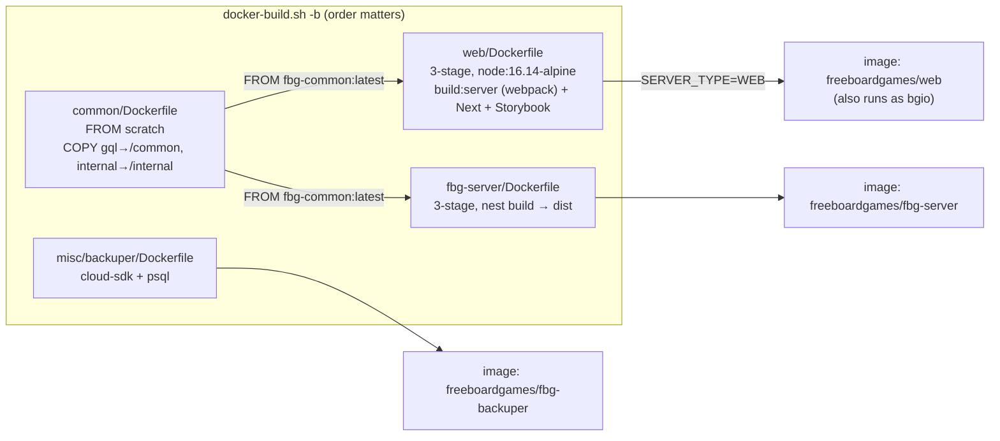
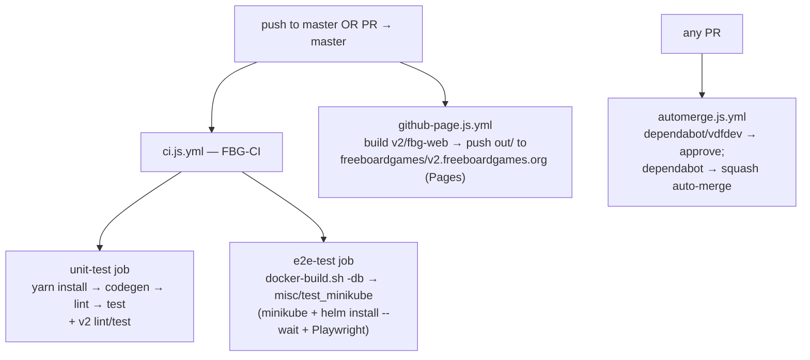
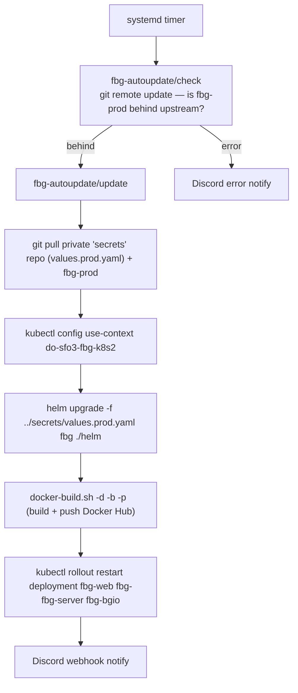

# 6 · DevOps & Deployment

_[← 5 · Scaling & clustering](05-scaling-clustering.md) · [Index](00-README.md)_

> **The question this chapter answers:** *"What DevOps runs FBG?"* — the Helm chart, the dual-image Docker build, CI, backups, and the (surprising) way production actually deploys.

**Hosting at a glance:** **DigitalOcean Kubernetes** (region SFO3, kubectl context `do-sfo3-fbg-k8s2`), images on **Docker Hub** (`freeboardgames/*`), DB backups to **Google Cloud Storage**, fronted by **Cloudflare**. Kubernetes + Helm is the **only** IaC — no Terraform/Pulumi/CloudFormation. AWS is not used for infra.

---

## 6.1 The Helm chart (`helm/`)

The chart `fbg` (version `0.1.14`, appVersion `1.28.0`) is the deployment unit. Structure:

| File | What it defines |
|---|---|
| `helm/Chart.yaml` / `Chart.lock` | Chart metadata + **subchart deps**: Bitnami `postgresql 9.8.9`, `redis 14.1.0` (vendored as tarballs in `helm/charts/`). |
| `helm/values.yaml` | Dev defaults; inline comments document the prod overrides. |
| `helm/templates/{web,bgio,fbg-server}-deployment.yaml` | The three Deployments (see [Ch.5 §5.4](05-scaling-clustering.md) and [diagram 04](diagrams/04-deployment-topology.drawio)). |
| `helm/templates/{web,bgio,fbg-server}-service.yaml` | Three **ClusterIP** Services (`:80 → containerPort`). External traffic only via the Ingress. |
| `helm/templates/ingress.yaml` | nginx Ingress: cert-manager TLS, CORS, force-ssl-redirect, cookie affinity, path routing. |
| `helm/templates/backuper-cronjob.yaml` | Daily Postgres backup CronJob (§6.4). |

**values.yaml — dev vs prod (the bits that differ):**

| Key | Dev (repo) | Prod (per comment / private override) |
|---|---|---|
| `domain` | `my-fbg.info` | `freeboardgames.org` |
| `images.imagePullPolicy` | `Never` | `Always` |
| `images.*` | `fbg-web` / `fbg-server` / `fbg-backuper` | `freeboardgames/*` |
| `replicas.*` | `1 / 1 / 1` | (private override) |
| `fbgServer.forceDbSync` | `true` | `false` |
| `redis.architecture` | `standalone` | standalone |
| `secrets.gcpCredsBase64` | `null` | base64 GCP creds |

> The full prod values (real secrets, replica counts) live in a **private `secrets/values.prod.yaml`**, applied at deploy time (§6.6). Some Redis keys the deployments reference (`redis.clusterDomain`, `redis.master.service.port`) aren't set in `values.yaml` — they resolve from the **Bitnami redis subchart defaults** (`cluster.local`, `6379`).

---

## 6.2 The dual-image Docker strategy

Three app images, built from a shared base. The clever bit is the **`common` scratch image** used purely as a code-sharing channel (no package registry needed).

- **`common/Dockerfile`** — `FROM scratch`, carrying only `gql/` (generated GraphQL types) and `internal/` (private config). Not runnable; consumed via `--from` in the other builds. This is how `web` and `fbg-server` share the `common` package without publishing it.
- **`web/Dockerfile`** — 3 stages (common → builder → runtime), non-root `appuser`, builds both the server bundle (`build:server`, webpack) and the Next.js site (incl. Storybook `/docs`). `CMD ./docker_run.sh` dispatches **WEB vs BGIO** on `SERVER_TYPE` ([Ch.1 §1.1](01-architecture-overview.md)) — **one image, two roles**.
- **`fbg-server/Dockerfile`** — 3 stages, `nest build` → `dist`, copies `dist` + `/internal` + `/common`. `CMD yarn start:prod` → `node dist/main`.
- **`docker-build.sh`** — menu-driven builder: `-d` compile deps (yarn install, `codegen`, i18n), `-b` build images **in order** (common first), `-p` push (web/fbg-server/backuper — **not** common), `-m` minikube cache. `yarn ci` runs `./docker-build.sh -db`.

---

## 6.3 Ingress & TLS

`helm/templates/ingress.yaml` is the production routing source of truth (the equivalent dev nginx config is documented in `web/docs/03_infra/RunningWithNginx.stories.mdx`):

- `cert-manager.io/cluster-issuer: letsencrypt-prod` + http01 challenge → **automated TLS**.
- `kubernetes.io/ingress.class: nginx`, `enable-cors`, `cors-allow-origin: https://{domain}`, `force-ssl-redirect: "true"`.
- `nginx.ingress.kubernetes.io/affinity: cookie` → **sticky sessions** (the socket.io stickiness, [Ch.4](04-boardgameio-sockets.md)/[Ch.5](05-scaling-clustering.md)).
- Path routing (longest-prefix): `/socket.io/` → bgio, `/graphql` → fbg-server, `/` → web.
- TLS secret `tls-secret-{release}` populated by cert-manager.

---

## 6.4 Database backups (the CronJob)

`helm/templates/backuper-cronjob.yaml` + `misc/backuper/`:

- **Schedule:** `0 12 * * *` (daily, 12:00 UTC). `restartPolicy: Never`.
- **Image:** `gcr.io/google.com/cloudsdktool/cloud-sdk` (gcloud + gsutil) + `postgresql-client` (`misc/backuper/Dockerfile`).
- **Script (`misc/backuper/backup.sh`):** decode `GCP_CREDS_BASE64` → activate service account → `pg_dump $POSTGRES_URL` → gzip → `gsutil cp` to `gs://fbg-database-dump`; then per-table CSV exports (`Games`, `match_entity`, `match_membership_entity`, `room_entity`, `room_membership_entity`, `user_entity`).
- ⚠️ **Retention gotcha:** the SQL dump is **date-stamped** (`fbg-backup-YYYY-MM-DD.sql.gz`, accumulates), but the **CSV exports have no date in the name → each run overwrites the previous CSV**. No rotation/expiry logic in-repo (lifecycle would be a GCS bucket policy). No `concurrencyPolicy`/`history limits` set on the CronJob (defaults).

---

## 6.5 CI (GitHub Actions)

- **`ci.js.yml` (FBG-CI)** runs on push to `master` and PRs to `master`, two parallel jobs:
  - **`unit-test`** — `yarn install` → `codegen` → `lint` → `test`, then the same for `v2/`.
  - **`e2e-test`** — builds images (`docker-build.sh -db`) then `misc/test_minikube`, which **spins up a real ephemeral cluster**: enables the minikube ingress addon, `helm install --wait fbg ./helm`, waits for the ingress IP, patches `/etc/hosts`, polls `fbg-server/healthz` + `bgio/games` + `web/en`, then runs the Playwright e2e suite. **The Helm chart is integration-tested on every PR.**
- **`automerge.js.yml`** — auto-approves Dependabot/`vdfdev` PRs and squash-auto-merges Dependabot ones once checks pass.
- **`github-page.js.yml`** — on push to `master`, builds the **v2** static export and pushes it to the `v2.freeboardgames.org` GitHub Pages repo (separate from the K8s app).
- **`dependabot.yml`** — npm, daily, for `/` and `/fbg-server` (note: `web/` and `v2/` are **not** covered).

---

## 6.6 ⚠️ How production actually deploys (NOT from CI)

This surprises people: **no GitHub workflow deploys to Kubernetes.** Production deploy is a **pull-based GitOps script on a host**, run by a systemd timer (`misc/fbg-autoupdate/`):

Key facts for a new engineer:
- **CI tests but never deploys.** The deploy host watches `upstream/master`; when it moves, the host pulls, builds, pushes images, and `helm upgrade`s.
- **Prod secrets/overrides live in a separate private git repo** (`secrets/values.prod.yaml`) — that's where real replica counts, JWT secret, DB/Redis passwords, and GCP creds come from.
- **Images are built on the deploy host**, not in CI.
- Deploy ends with a `kubectl rollout restart` (so pods pick up the freshly-pushed `:latest` images) and a Discord notification.

---

## 6.7 Monorepo glue (`/cli`, root `package.json`)

- The repo is a home-grown monorepo (`fbg-runner`) — **no Nx/Turborepo**. Root scripts wrap node CLIs under `/cli`: `codegen`, `test`, `lint`, `fix`, `dev` (e.g. `yarn run dev GAME`).
- `/cli` is a small shelljs/chalk task runner (`cli/util.js`): resolves repo root, runs subcommands, validates the environment. Subdirs `codegen/`, `dev/`, `lint/`, `test/`, `fix/` are the entrypoints invoked as `node ../cli/.../cli.js` from `web/` and `fbg-server/`.
- `yarn run codegen` generates the game index and GraphQL types into `common/gql` — run it after changing the GraphQL schema or adding a game.

---

## 6.8 Local development quickstart

| Goal | Command | Notes |
|---|---|---|
| Run web + backend for online play | `yarn install` then `yarn run dev` (repo root) | Per the top-level README. |
| Run one game's dev env | `yarn run dev GAME` | Faster iteration. |
| Run everything CI runs | `yarn run ci` | `yarn test && ./docker-build.sh -db && ./misc/test_minikube`. |
| fbg-server only | `cd fbg-server && yarn start:dev` | NestJS watch mode, :3001; SQLite if no `POSTGRES_URL`. |
| Local Kubernetes | minikube + `helm install fbg ./helm` | See `web/docs/03_infra/RunningOnKubernetes.stories.mdx`. |
| Debugging fbg-server | — | `web/docs/02_how_to/4.DebuggingFbgServer.stories.mdx`. |

> The existing **Storybook docs** under `web/docs/` (`01_getting_started`, `02_how_to`, `03_infra`) complement these backend docs with game-authoring and how-to material. They build into `/docs` on the web image (note: prod `/docs` has historically 404'd — the Storybook output is build-time only and gitignored).

---

## 6.9 Takeaways

1. **Helm on DigitalOcean K8s** is the only IaC; Postgres + Redis are Bitnami subcharts.
2. **One web image runs as web *or* bgio**; a `scratch` `common` image shares code across builds.
3. **Ingress** does TLS (cert-manager), routing, CORS, and the cookie stickiness.
4. **Daily `pg_dump` → GCS**; mind the CSV-overwrite retention gotcha.
5. **CI runs a full minikube+helm e2e on every PR** but **does not deploy**.
6. **Prod deploys via a pull-based GitOps script** using a **private secrets repo** — not from GitHub Actions.

_[← 5 · Scaling & clustering](05-scaling-clustering.md) · [Index](00-README.md)_
