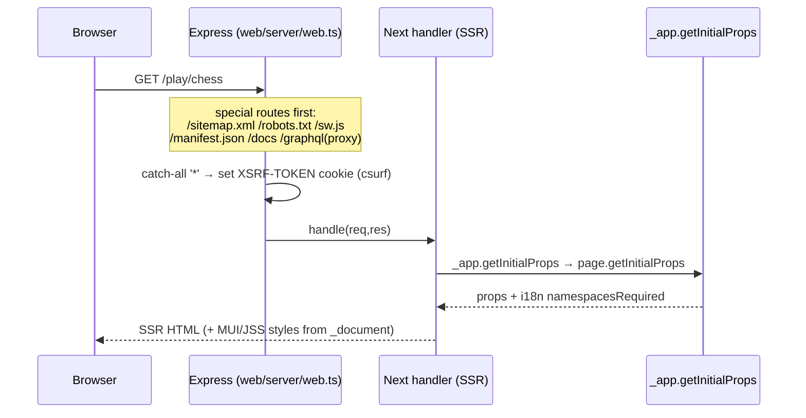
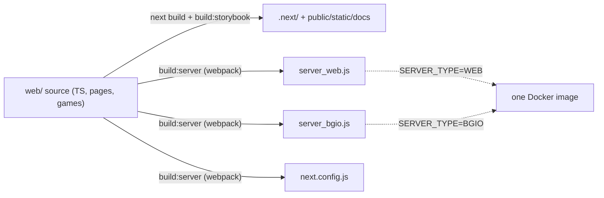

# 7 · The web tier & Next.js

_[← 6 · DevOps & deployment](06-devops-deployment.md) · [Index](00-README.md)_

> **Why a backend engineer should read this:** the `web` process is a **Node/Express server**, not just a frontend — it does SSR, serves `/docs`, **reverse-proxies `/graphql`** to fbg-server, and is the **same image that runs `bgio`**. Understanding its Next.js model is part of understanding the backend.
>
> **The short answer to "does FBG use Next.js features?":** **Yes — heavily — but in a *legacy* way.** It's **Next.js 9.5.5** (pages router) in **custom-server SSR** mode. Because the version predates the modern era, it **deliberately cannot** use the App Router, `next/image`, `next/script`, middleware, or built-in i18n routing — and it **substitutes its own** mechanisms for each.

---

## 7.1 Version & what that rules out

| | Production `web/` | Experimental `v2/fbg-web` |
|---|---|---|
| `next` | **9.5.5** (pinned, no caret) | 13.5.0 |
| `react` | **16.14.0** | 18.2.0 |

Because `web/` is on **9.5.5**, these modern features are **unavailable by version** (don't go looking for them):

| Feature | Added in | FBG substitute |
|---|---|---|
| App Router (`app/`), RSC | Next 13 | Pages router (`src/pages/`) |
| `next/image` | Next 10 | **`next-optimized-images`** (build-time) + `` ([§7.9](#79-images--assets)) |
| Built-in i18n routing | Next 10 | **`next-i18next` v7** + custom rewrites ([§7.8](#78-internationalization)) |
| `next/script` | Next 11 | scripts inlined via `next/head`/`_app` |
| Middleware | Next 12 | logic lives in the **Express** custom server |
| ISR / `getStaticProps` revalidate | Next 9.5+/10 | none — it's **SSR** |

---

## 7.2 The rendering model: custom Express server + **global SSR**

FBG runs Next in **custom-server** mode and makes the **whole app server-rendered**.

- **Custom server:** `next({ dev })` → `app.getRequestHandler()` → `app.prepare()` (`web/server/web.ts:19-34`). Express owns routing; Next handles the catch-all.
- **Express routes handled *before* Next** (first match wins): `/.well-known/assetlinks.json`, `/sitemap.xml`, `/robots.txt`, `/sw.js`, `/manifest.json`, `/blog*`→`/docs`, `/docs` (static Storybook), **`/graphql`** (proxy to fbg-server), then catch-all `*` → Next with a CSRF cookie (`web/server/web.ts:40-89`).
- **Global SSR:** because `_app.tsx` defines `getInitialProps` (`web/src/pages/_app.tsx:105-113`), **every** page is server-rendered and **Automatic Static Optimization is disabled** app-wide. This is the single most important fact about the rendering model.

> See [Ch.1 §1.3](01-architecture-overview.md) for how this sits behind Cloudflare/ingress, and [Ch.6 §6.2](06-devops-deployment.md) for the dual-image build (the same image runs `bgio`).

---

## 7.3 Routing & the special pages

Pages live in `web/src/pages/` (TypeScript, **pages router**). Dynamic routes use single-segment `[param]` only (no `[...catch-all]`):

| Route | Notes |
|---|---|
| `pages/index.tsx` | re-exports `Home` |
| `pages/about.tsx` | uses `useRouter`, MUI, SEO |
| `pages/g/[gameCode]/index.tsx` | legacy → 301 redirect (`getInitialProps`) |
| `pages/play/[gameCode]/index.tsx` | game info / mode picker |
| `pages/play/[gameCode]/[mode]/index.tsx` | AI / local-friend match |
| `pages/room/[roomID]/index.tsx` | online room — `next/dynamic`, `ssr:false` |
| `pages/match/[matchId]/index.tsx` | online match — `next/dynamic`, `ssr:false` |

**The three special pages:**
- **`_app.tsx`** — the provider tree + global SSR trigger. Wires **Apollo** (HTTP link + WebSocket-link split for subscriptions, `:24-57`), **MUI `ThemeProvider`** (`:93`), `GameProvider`, `next/head` global meta (`:81-92`), **Sentry** (prod host only), and composes `withRedux` (next-redux-wrapper) + `appWithTranslation` (next-i18next) + `withError` (next-with-error) via `recompose.compose` (`:116-118`).
- **`_document.tsx`** — **MUI v4 / JSS server-side style injection**: `ServerStyleSheets` collects CSS, prod runs it through PostCSS autoprefixer + clean-css, injected as `<style id="jss-server-side">` (`:5,43-92`); plus favicons + `<link rel="manifest">` (`:24-33`).
- **`_error.tsx`** — the error **and** 404 page (there is **no separate `404.tsx`**); renders a translated message (`:6-15`), and is fed to `withError` so thrown page errors render it.

---

## 7.4 Data fetching: `getInitialProps` only

- **`getServerSideProps`, `getStaticProps`, `getStaticPaths`, ISR: none** (zero occurrences).
- **`getInitialProps`: used throughout** (~19 sites). `_app`'s drives global SSR; per-page ones do redirects, 404s (`generatePageError`), and — importantly — declare i18n **`namespacesRequired`** so translations are server-loaded (e.g. `web/src/infra/home/Home.tsx:44-54`, `web/src/pages/match/[matchId]/index.tsx:16-29`).

> ⚠️ **For onboarding:** this is the *classic* Next 9 pattern. If you've only used modern Next (App Router / `getServerSideProps`), recalibrate: in FBG, **`getInitialProps` is the data-fetching API**, and it runs on the server for the first load and on the client for subsequent navigations.

---

## 7.5 Which Next APIs are actually imported

| API | Status | How / why |
|---|---|---|
| `next/app`, `next/document`, `next/head` | **USED** | provider tree, MUI SSR, global meta |
| `next/dynamic` (`ssr:false`) | **USED** | client-only render of Game/Room/Match (boardgame.io needs the browser) — `AIOrLocalGame.tsx:11`, `room/[roomID]/index.tsx:6`, `match/[matchId]/index.tsx:6` |
| `next/router` | **USED** | `useRouter` (`about.tsx:12`); nav otherwise via next-i18next's locale-aware `Router` |
| `next/link` | **TYPE-ONLY** | imported once as a *type* (`infra/i18n/types/LinkProps.ts:2`); real `<Link>` is next-i18next's locale-aware one |
| `next/config`, `next/error`, `next/amp` | **NOT USED** | runtime config replaced by the `env` block; errors via custom `_error.tsx` |
| `next/image`, `next/script`, middleware, `pages/api` | **NOT USED** | version (image/script/middleware) or design (no API routes — the backend is fbg-server, reached via the `/graphql` proxy) |

---

## 7.6 `next.config` — what's customized

The real config is `web/server/next.config.ts` (compiled; `web/next.config.js` just re-exports it). It composes two plugins by manual nesting: `withWorkers(withOptimizedImages({ ... }))`.

- **`@zeit/next-workers`** — enables `worker-loader` so **AI bots run in Web Workers** (`next.config.ts:6,24`).
- **`next-optimized-images`** — build-time image pipeline; also sets **`cssModules: true`** (this is what enables CSS Modules project-wide), `responsive-loader` default, optipng level 7, mozjpeg q80 (`:26-35`).
- **`env` block** — build-time vars exposed to the client: `CHANNEL`, `VERSION` (git short hash), `BABEL_ENV_IS_PROD` (`:12-22,37-41`), read in e.g. `_app.tsx:69-70`. **This replaces `next/config` runtime config.**
- **`webpack()`** customization (`:42-95`): `ignore-loader` strips tests from the bundle, **`raw-loader` for `*.md`** (game instructions imported as strings), `url-loader` for webp/mp3/wav, `webpackbar`, `tsconfig-paths-webpack-plugin`, and `i18next-hmr` for locale hot-reload.
- **`rewrites()` / `redirects()`** → i18n route translation + locale subpaths ([§7.8](#78-internationalization)).
- **Not present:** `assetPrefix`, `headers()`, `pageExtensions`, experimental flags, `next-pwa`, Sentry webpack plugin.

---

## 7.7 Styling

- **Material-UI v4** (JSS) is the primary system: default `createMuiTheme()` (`infra/common/components/base/theme.ts:3`), `ThemeProvider` in `_app`, **SSR style injection** in `_document` (the `#jss-server-side` block). `makeStyles`/`withStyles` used across components.
- **CSS Modules** are the dominant component styling — **~114 `*.module.css`** imports — enabled by `cssModules: true` in next-optimized-images.
- **styled-jsx** ships with Next but is **not authored** (no `<style jsx>` blocks). **No Sass/Less.**

---

## 7.8 Internationalization

Next 9.5 has **no built-in i18n routing**, so FBG builds its own around **`next-i18next@7`** (the legacy HOC model):

- **Central instance:** `web/src/infra/i18n/config.ts:8-16` (`new NextI18Next({ defaultLanguage:'en', otherLanguages:['pt','de','fr','it'], localeSubpaths, ... })`). All i18n exports (`appWithTranslation`, `useTranslation`, `Trans`, `Link`, `Router`) come from this one object.
- **Locale source of truth:** `web/server/config/i18n/config.ts` (`locales: ['en','pt','de','fr','it']`), consumed by both next.config's `i18n` key and the NextI18Next instance. Locale JSON lives in `web/public/static/locales/`.
- **Routing:** `rewrites()`/`redirects()` in next.config provide **translated route verbs** (e.g. localized "play") + locale subpaths (`/en`, `/pt`, …) — `web/server/config/i18n/rewrite.ts`.
- **SSR of translations:** pages declare `namespacesRequired` in `getInitialProps`, so next-i18next server-loads exactly those namespaces (per-game namespaces appended dynamically).

> Note: there is **no `NEXT_PUBLIC_I18N_ENABLED` gate** in `web/` — i18n is unconditionally on. (That flag is a `v2` concept, and Helm sets it for the web deployment env but the legacy app doesn't read it.)

---

## 7.9 Images & assets

- **`next-optimized-images`** (build-time) — images are `import`ed/`require`d directly and the loader returns an optimized URL (~146 asset imports; e.g. `games/reversi/index.ts:1` `require('./media/thumbnail.jpg')`). Loaders: responsive/webp/lqip/imagemin (optipng/mozjpeg/gifsicle/svgo). Rendered with plain `` / MUI components.
- **No `next/image`** (Next 10 feature). Static assets under `web/public/static/`.

---

## 7.10 PWA, service worker & SEO

- **Service worker** `web/public/static/sw.js` is a **self-unregistering kill-switch** — on activate it `unregister()`s and reloads. It does **not** cache; it removes any previously-installed SW. **No `next-pwa`/Workbox.**
- **Manifest** `public/static/manifest.json` (linked in `_document`). **robots.txt** has prod vs restrictive variants chosen by Express. **sitemap.xml** is **generated in Node at server boot** with per-locale `hreflang` alternates (`web/server/sitemap/*`), then served by Express.
- **SEO:** **`next-seo`** (`NextSeo`, global `noindex` off-prod) + **JSON-LD breadcrumbs** (`infra/common/helpers/{SEO,Breadcrumbs}.tsx`).

---

## 7.11 Code-splitting

- **Automatic per-page** chunking (pages router).
- **`next/dynamic` `ssr:false`** for the heavy interactive surfaces (Game/Room/Match) — boardgame.io must run in the browser.
- **Lazy game loaders:** each game lazy-imports its rules + AI (`games/*/index.ts` `config: () => import('./config')`); the bgio server resolves them on demand and the client loads only the played game's bundle. The `GAMES_LIST` registry is **codegen-generated** ([Ch.4b §"game registry"](04b-fbg-vs-boardgameio.md), `cli/codegen/genGames.js`).

---

## 7.12 Build pipeline

- **Client:** `next build` (production env) then `build:storybook` → static Storybook into `public/static/docs` (served at `/docs`).
- **Server:** `build:server` runs **webpack** (`web/webpack.server.config.js`) to bundle **three Node entrypoints** into `server/dist/`:
  - `server_web.js` — the Express+Next server (`SERVER_TYPE=WEB`)
  - `server_bgio.js` — the boardgame.io server (`SERVER_TYPE=BGIO`) ([Ch.4](04-boardgameio-sockets.md))
  - `next.config.js` — the compiled config consumed at runtime
- TypeScript throughout (`tsconfig.json`, path aliases via `tsconfig-paths-webpack-plugin`). Babel uses the `next/babel` preset.

---

## 7.13 Contrast: the `/v2` rewrite (Next 13)

`v2/fbg-web` is the opposite stack and a useful reference for "what modern would look like": **Next 13.5 / React 18**, a **fully static export** (`next build && next export`, served by `http-server`), **SSG** via `getStaticProps`/`getStaticPaths` on every route (vs `web/`'s `getInitialProps` SSR), **raw `next/link`**, **MUI v5 + Emotion** (vs v4/JSS), `[lang]`-segment routing with **next-i18next v12** + `next-compose-plugins`. It is **not** production — `web/` is — but it shows the intended migration target.

---

## 7.14 Next.js feature summary

| Feature | Used? | Evidence |
|---|---|---|
| Pages router | ✅ | `web/src/pages/*` |
| App Router / RSC | ❌ version | — |
| Custom Express server | ✅ | `server/web.ts:19-89` |
| Global SSR (`_app.getInitialProps`) | ✅ | `_app.tsx:105-113` |
| `getServerSideProps` / `getStaticProps` / ISR | ❌ | grep = 0 |
| `next/dynamic` (`ssr:false`) | ✅ | `AIOrLocalGame.tsx:11` |
| `next/head` / `next/app` / `next/document` | ✅ | `_app.tsx`, `_document.tsx` |
| `next/router` | ✅ | `about.tsx:12` |
| `next/link` (for nav) | ❌ replaced | next-i18next `Link` |
| `next/image` / `next/script` / middleware | ❌ version | — |
| API routes (`pages/api`) | ❌ design | proxy to fbg-server |
| Built-in i18n routing | ❌ replaced | next-i18next v7 + rewrites |
| MUI v4 (JSS SSR) + CSS Modules | ✅ | `_document.tsx:62-90`; `next.config.ts:26` |
| Web Workers (`@zeit/next-workers`) | ✅ | `next.config.ts:6,24` |
| next-optimized-images (build-time) | ✅ | `next.config.ts:25-35` |
| next-seo + JSON-LD | ✅ | `SEO.tsx`, `Breadcrumbs.tsx` |
| PWA service worker | ⚠️ kill-switch only | `public/static/sw.js` |
| Code-splitting (auto + dynamic + lazy games) | ✅ | `reversi/index.ts:23-24` |

---

## 7.15 Takeaways

1. **Yes, FBG uses Next.js a lot** — pages router, custom-server **global SSR** (`getInitialProps`), `next/dynamic`, `next/head`, dynamic webpack config, code-splitting, web workers.
2. It's **Next 9.5.5**, so the modern stack (App Router, `next/image`, `next/script`, middleware, built-in i18n) is **out** — FBG **rolls its own** (Express middleware, next-optimized-images, next-i18next, MUI/JSS).
3. The **web process is a real Node server** — SSR + the `/graphql` proxy + the bgio entrypoint — which is why it matters to backend engineers.
4. **No API routes** — the backend is fbg-server; web only proxies.
5. **`/v2`** shows the modern target (Next 13, static export, SSG) but is not in production.

_[← 6 · DevOps & deployment](06-devops-deployment.md) · [Index](00-README.md)_
